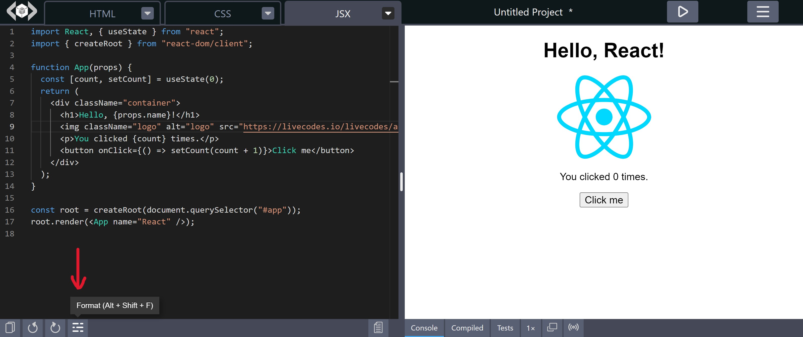

# Code Format

Code formatting is supported for most [languages](../languages/index.md).

## Code Formatters

The code formatter used for each language is specified in the [language documentation](../languages/index.md) page.

For example:

- [Prettier](https://prettier.io/) is used for many languages including HTML, CSS, JavaScript, TypeScript, JSX, TSX.
- [gofmt](https://pkg.go.dev/cmd/gofmt) (via [GopherJS](https://github.com/gopherjs/gopherjs)) is used for Go.
- [Parinfer](https://shaunlebron.github.io/parinfer/) is used for Scheme, Common Lisp and ClojureScript.

## Format Button

Code formatting for the code in the active editor can be triggered by the `Format` button below the editor.

## Keyboard Shortcut

Code formatting can also be trigger by the keyboard shortcut <kbd>Alt</kbd> + <kbd>Shift</kbd> + <kbd>F</kbd>.

## Format on-save

Format on-save can be enabled from the app menu → Format on-save.

## Format Options

Some format options can be configured from [Editor Settings](./editor-settings.md) screen. These include [Prettier](https://prettier.io/) [configuration options](https://prettier.io/docs/en/options.html) for:

- Indentation (Spaces/Tabs)
- Tab size
- Use Semicolons
- Use Single Quotes
- Use Trailing Commas

## Configuration

Code format can be configured using the [configuration object](../configuration/configuration-object.md) properties:

- [`formatOnsave`](../configuration/configuration-object.md#formatonsave)
- [`useTabs`](../configuration/configuration-object.md#usetabs)
- [`tabSize`](../configuration/configuration-object.md#tabsize)
- [`semicolons`](../configuration/configuration-object.md#semicolons)
- [`singleQuote`](../configuration/configuration-object.md#singlequote)
- [`trailingComma`](../configuration/configuration-object.md#trailingcomma)

## SDK Method: `format`

The code format can be programmatically triggered by the [SDK](../sdk/index.md) method [`format`](../sdk/js-ts.md#format).
