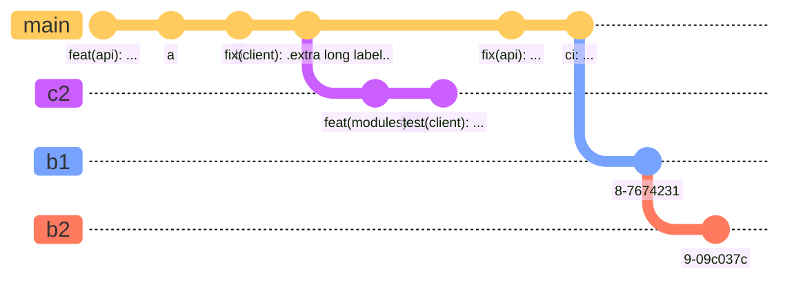

### All Documentation Graphics Code Posibilities    
Full documentation Codes and posibilities are on [MerMaid](https://mermaid.js.org/intro/)    
    
---    
### All Codes needs Copy / Paste Only of codes to code block    
    
---    
erDiagram    
          CUSTOMER }|..|{ DELIVERY-ADDRESS : has    
          CUSTOMER ||--o{ ORDER : places    
          CUSTOMER ||--o{ INVOICE : "liable for"    
          DELIVERY-ADDRESS ||--o{ ORDER : receives    
          INVOICE ||--|{ ORDER : covers    
          ORDER ||--|{ ORDER-ITEM : includes    
          PRODUCT-CATEGORY ||--|{ PRODUCT : contains    
          PRODUCT ||--o{ ORDER-ITEM : "ordered in"    

---    
flowchart LR    
   a --> b & c--> d    

---    
sequenceDiagram    
    participant Alice    
    participant Bob    
    Alice->>John: Hello John, how are you?    
    loop Healthcheck    
        John->>John: Fight against hypochondria    
    end    
    Note right of John: Rational thoughts <br/>prevail!    
    John-->>Alice: Great!    
    John->>Bob: How about you?    
    Bob-->>John: Jolly good!    

---    
gantt    
dateFormat  YYYY-MM-DD    
title Adding GANTT diagram to mermaid    
excludes weekdays 2014-01-10    
    
section A section    
Completed task            :done,    des1, 2014-01-06,2014-01-08    
Active task               :active,  des2, 2014-01-09, 3d    
Future task               :         des3, after des2, 5d    
Future task2               :         des4, after des3, 5d    

---    
classDiagram    
Class01 <|-- AveryLongClass : Cool    
Class03 *-- Class04    
Class05 o-- Class06    
Class07 .. Class08    
Class09 --> C2 : Where am i?    
Class09 --* C3    
Class09 --|> Class07    
Class07 : equals()    
Class07 : Object[] elementData    
Class01 : size()    
Class01 : int chimp    
Class01 : int gorilla    
Class08 <--> C2: Cool label    

---    
gitGraph    
       commit    
       commit    
       branch develop    
       commit    
       commit    
       commit    
       checkout main    
       commit    
       commit    

---    
erDiagram    
    CUSTOMER ||--o{ ORDER : places    
    ORDER ||--|{ LINE-ITEM : contains    
    CUSTOMER }|..|{ DELIVERY-ADDRESS : uses    

---    
journey    
    title My working day    
    section Go to work    
      Make tea: 5: Me    
      Go upstairs: 3: Me    
      Do work: 1: Me, Cat    
    section Go home    
      Go downstairs: 5: Me    
      Sit down: 5: Me    

---    
quadrantChart    
    title Reach and engagement of campaigns    
    x-axis Low Reach --> High Reach    
    y-axis Low Engagement --> High Engagement    
    quadrant-1 We should expand    
    quadrant-2 Need to promote    
    quadrant-3 Re-evaluate    
    quadrant-4 May be improved    
    Campaign A: [0.3, 0.6]    
    Campaign B: [0.45, 0.23]    
    Campaign C: [0.57, 0.69]    
    Campaign D: [0.78, 0.34]    
    Campaign E: [0.40, 0.34]    
    Campaign F: [0.35, 0.78]    

---    
flowchart TB    
    c1-->a2    
    subgraph one    
    a1-->a2    
    end    
    subgraph two    
    b1-->b2    
    end    
    subgraph three    
    c1-->c2    
    end    

---    
sequenceDiagram    
    box Purple Alice & John    
    participant A    
    participant J    
    end    
    box Another Group    
    participant B    
    participant C    
    end    
    A->>J: Hello John, how are you?    
    J->>A: Great!    
    A->>B: Hello Bob, how is Charly ?    
    B->>C: Hello Charly, how are you?    

---    
sequenceDiagram    
    autonumber    
    Alice->>John: Hello John, how are you?    
    loop Healthcheck    
        John->>John: Fight against hypochondria    
    end    
    Note right of John: Rational thoughts!    
    John-->>Alice: Great!    
    John->>Bob: How about you?    
    Bob-->>John: Jolly good!    
```mermaid    
sequenceDiagram    
    autonumber    
    Alice->>John: Hello John, how are you?    
    loop Healthcheck    
        John->>John: Fight against hypochondria    
    end    
    Note right of John: Rational thoughts!    
    John-->>Alice: Great!    
    John->>Bob: How about you?    
    Bob-->>John: Jolly good!    
```    
---    
---    
title: Animal example    
---    
classDiagram    
    note "From Duck till Zebra"    
    Animal <|-- Duck    
    note for Duck "can fly\ncan swim\ncan dive\ncan help in debugging"    
    Animal <|-- Fish    
    Animal <|-- Zebra    
    Animal : +int age    
    Animal : +String gender    
    Animal: +isMammal()    
    Animal: +mate()    
    class Duck{    
        +String beakColor    
        +swim()    
        +quack()    
    }    
    class Fish{    
        -int sizeInFeet    
        -canEat()    
    }    
    class Zebra{    
        +bool is_wild    
        +run()    
    }    

---    
classDiagram    
classA --|> classB : Inheritance    
classC --* classD : Composition    
classE --o classF : Aggregation    
classG --> classH : Association    
classI -- classJ : Link(Solid)    
classK ..> classL : Dependency    
classM ..|> classN : Realization    
classO .. classP : Link(Dashed)    

---    
stateDiagram-v2    
    [*] --> Active    
    
    state Active {    
        [*] --> NumLockOff    
        NumLockOff --> NumLockOn : EvNumLockPressed    
        NumLockOn --> NumLockOff : EvNumLockPressed    
        --    
        [*] --> CapsLockOff    
        CapsLockOff --> CapsLockOn : EvCapsLockPressed    
        CapsLockOn --> CapsLockOff : EvCapsLockPressed    
        --    
        [*] --> ScrollLockOff    
        ScrollLockOff --> ScrollLockOn : EvScrollLockPressed    
        ScrollLockOn --> ScrollLockOff : EvScrollLockPressed    
    }    

---    
erDiagram    
    CAR ||--o{ NAMED-DRIVER : allows    
    CAR {    
        string registrationNumber PK    
        string make    
        string model    
        string[] parts    
    }    
    PERSON ||--o{ NAMED-DRIVER : is    
    PERSON {    
        string driversLicense PK "The license #"    
        string(99) firstName "Only 99 characters are allowed"    
        string lastName    
        string phone UK    
        int age    
    }    
    NAMED-DRIVER {    
        string carRegistrationNumber PK, FK    
        string driverLicence PK, FK    
    }    
    MANUFACTURER only one to zero or more CAR : makes    

---    
gantt    
    dateFormat  YYYY-MM-DD    
    title       Adding GANTT diagram functionality to mermaid    
    excludes    weekends    
    %% (`excludes` accepts specific dates in YYYY-MM-DD format, days of the week ("sunday") or "weekends", but not the word "weekdays".)    
    
    section A section    
    Completed task            :done,    des1, 2014-01-06,2014-01-08    
    Active task               :active,  des2, 2014-01-09, 3d    
    Future task               :         des3, after des2, 5d    
    Future task2              :         des4, after des3, 5d    
    
    section Critical tasks    
    Completed task in the critical line :crit, done, 2014-01-06,24h    
    Implement parser and jison          :crit, done, after des1, 2d    
    Create tests for parser             :crit, active, 3d    
    Future task in critical line        :crit, 5d    
    Create tests for renderer           :2d    
    Add to mermaid                      :1d    
    Functionality added                 :milestone, 2014-01-25, 0d    
    
    section Documentation    
    Describe gantt syntax               :active, a1, after des1, 3d    
    Add gantt diagram to demo page      :after a1  , 20h    
    Add another diagram to demo page    :doc1, after a1  , 48h    
    
    section Last section    
    Describe gantt syntax               :after doc1, 3d    
    Add gantt diagram to demo page      :20h    
    Add another diagram to demo page    :48h    

---    
requirementDiagram    
    
    requirement test_req {    
    id: 1    
    text: the test text.    
    risk: high    
    verifymethod: test    
    }    
    
    functionalRequirement test_req2 {    
    id: 1.1    
    text: the second test text.    
    risk: low    
    verifymethod: inspection    
    }    
    
    performanceRequirement test_req3 {    
    id: 1.2    
    text: the third test text.    
    risk: medium    
    verifymethod: demonstration    
    }    
    
    interfaceRequirement test_req4 {    
    id: 1.2.1    
    text: the fourth test text.    
    risk: medium    
    verifymethod: analysis    
    }    
    
    physicalRequirement test_req5 {    
    id: 1.2.2    
    text: the fifth test text.    
    risk: medium    
    verifymethod: analysis    
    }    
    
    designConstraint test_req6 {    
    id: 1.2.3    
    text: the sixth test text.    
    risk: medium    
    verifymethod: analysis    
    }    
    
    element test_entity {    
    type: simulation    
    }    
    
    element test_entity2 {    
    type: word doc    
    docRef: reqs/test_entity    
    }    
    
    element test_entity3 {    
    type: "test suite"    
    docRef: github.com/all_the_tests    
    }    
    
    
    test_entity - satisfies -> test_req2    
    test_req - traces -> test_req2    
    test_req - contains -> test_req3    
    test_req3 - contains -> test_req4    
    test_req4 - derives -> test_req5    
    test_req5 - refines -> test_req6    
    test_entity3 - verifies -> test_req5    
    test_req <- copies - test_entity2    
```mermaid    
requirementDiagram    
    
    requirement test_req {    
    id: 1    
    text: the test text.    
    risk: high    
    verifymethod: test    
    }    
    
    functionalRequirement test_req2 {    
    id: 1.1    
    text: the second test text.    
    risk: low    
    verifymethod: inspection    
    }    
    
    performanceRequirement test_req3 {    
    id: 1.2    
    text: the third test text.    
    risk: medium    
    verifymethod: demonstration    
    }    
    
    interfaceRequirement test_req4 {    
    id: 1.2.1    
    text: the fourth test text.    
    risk: medium    
    verifymethod: analysis    
    }    
    
    physicalRequirement test_req5 {    
    id: 1.2.2    
    text: the fifth test text.    
    risk: medium    
    verifymethod: analysis    
    }    
    
    designConstraint test_req6 {    
    id: 1.2.3    
    text: the sixth test text.    
    risk: medium    
    verifymethod: analysis    
    }    
    
    element test_entity {    
    type: simulation    
    }    
    
    element test_entity2 {    
    type: word doc    
    docRef: reqs/test_entity    
    }    
    
    element test_entity3 {    
    type: "test suite"    
    docRef: github.com/all_the_tests    
    }    
    
    
    test_entity - satisfies -> test_req2    
    test_req - traces -> test_req2    
    test_req - contains -> test_req3    
    test_req3 - contains -> test_req4    
    test_req4 - derives -> test_req5    
    test_req5 - refines -> test_req6    
    test_entity3 - verifies -> test_req5    
    test_req <- copies - test_entity2    
```    
---    
%%{init: { 'logLevel': 'debug', 'theme': 'base', 'gitGraph': {'rotateCommitLabel': false}} }%%    
gitGraph    
  commit id: "feat(api): ..."    
  commit id: "a"    
  commit id: "b"    
  commit id: "fix(client): .extra long label.."    
  branch c2    
  commit id: "feat(modules): ..."    
  commit id: "test(client): ..."    
  checkout main    
  commit id: "fix(api): ..."    
  commit id: "ci: ..."    
  branch b1    
  commit    
  branch b2    
  commit    

---    
C4Context    
      title System Context diagram for Internet Banking System    
      Enterprise_Boundary(b0, "BankBoundary0") {    
        Person(customerA, "Banking Customer A", "A customer of the bank, with personal bank accounts.")    
        Person(customerB, "Banking Customer B")    
        Person_Ext(customerC, "Banking Customer C", "desc")    
    
        Person(customerD, "Banking Customer D", "A customer of the bank, <br/> with personal bank accounts.")    
    
        System(SystemAA, "Internet Banking System", "Allows customers to view information about their bank accounts, and make payments.")    
    
        Enterprise_Boundary(b1, "BankBoundary") {    
    
          SystemDb_Ext(SystemE, "Mainframe Banking System", "Stores all of the core banking information about customers, accounts, transactions, etc.")    
    
          System_Boundary(b2, "BankBoundary2") {    
            System(SystemA, "Banking System A")    
            System(SystemB, "Banking System B", "A system of the bank, with personal bank accounts. next line.")    
          }    
    
          System_Ext(SystemC, "E-mail system", "The internal Microsoft Exchange e-mail system.")    
          SystemDb(SystemD, "Banking System D Database", "A system of the bank, with personal bank accounts.")    
    
          Boundary(b3, "BankBoundary3", "boundary") {    
            SystemQueue(SystemF, "Banking System F Queue", "A system of the bank.")    
            SystemQueue_Ext(SystemG, "Banking System G Queue", "A system of the bank, with personal bank accounts.")    
          }    
        }    
      }    
    
      BiRel(customerA, SystemAA, "Uses")    
      BiRel(SystemAA, SystemE, "Uses")    
      Rel(SystemAA, SystemC, "Sends e-mails", "SMTP")    
      Rel(SystemC, customerA, "Sends e-mails to")    
    
      UpdateElementStyle(customerA, $fontColor="red", $bgColor="grey", $borderColor="red")    
      UpdateRelStyle(customerA, SystemAA, $textColor="blue", $lineColor="blue", $offsetX="5")    
      UpdateRelStyle(SystemAA, SystemE, $textColor="blue", $lineColor="blue", $offsetY="-10")    
      UpdateRelStyle(SystemAA, SystemC, $textColor="blue", $lineColor="blue", $offsetY="-40", $offsetX="-50")    
      UpdateRelStyle(SystemC, customerA, $textColor="red", $lineColor="red", $offsetX="-50", $offsetY="20")    
    
      UpdateLayoutConfig($c4ShapeInRow="3", $c4BoundaryInRow="1")    

---    
mindmap    
  root((mindmap))    
    Origins    
      Long history    
      ::icon(fa fa-book)    
      Popularisation    
        British popular psychology author Tony Buzan    
    Research    
      On effectiveness<br/>and features    
      On Automatic creation    
        Uses    
            Creative techniques    
            Strategic planning    
            Argument mapping    
    Tools    
      Pen and paper    
      Mermaid    
```mermaid    
mindmap    
  root((mindmap))    
    Origins    
      Long history    
      ::icon(fa fa-book)    
      Popularisation    
        British popular psychology author Tony Buzan    
    Research    
      On effectiveness<br/>and features    
      On Automatic creation    
        Uses    
            Creative techniques    
            Strategic planning    
            Argument mapping    
    Tools    
      Pen and paper    
      Mermaid    
```    
---    
timeline    
    title History of Social Media Platform    
    2002 : LinkedIn    
    2004 : Facebook    
         : Google    
    2005 : Youtube    
    2006 : Twitter    
2002    
LinkedIn    
2004    
Facebook    
Google    
2005    
Youtube    
2006    
Twitter    
    
```mermaid    
timeline    
    title History of Social Media Platform    
    2002 : LinkedIn    
    2004 : Facebook    
         : Google    
    2005 : Youtube    
    2006 : Twitter    
2002    
LinkedIn    
2004    
Facebook    
Google    
2005    
Youtube    
2006    
Twitter    
    
```    
---    
%%{init: { 'logLevel': 'debug', 'theme': 'forest' } }%%    
    timeline    
        title History of Social Media Platform    
          2002 : LinkedIn    
          2004 : Facebook : Google    
          2005 : Youtube    
          2006 : Twitter    
          2007 : Tumblr    
          2008 : Instagram    
          2010 : Pinterest    
```mermaid    
%%{init: { 'logLevel': 'debug', 'theme': 'forest' } }%%    
    timeline    
        title History of Social Media Platform    
          2002 : LinkedIn    
          2004 : Facebook : Google    
          2005 : Youtube    
          2006 : Twitter    
          2007 : Tumblr    
          2008 : Instagram    
          2010 : Pinterest    
```    
---    
---    
config:    
  sankey:    
    showValues: false    
---    
sankey-beta    
    
Agricultural 'waste',Bio-conversion,124.729    
Bio-conversion,Liquid,0.597    
Bio-conversion,Losses,26.862    
Bio-conversion,Solid,280.322    
Bio-conversion,Gas,81.144    
Biofuel imports,Liquid,35    
Biomass imports,Solid,35    
Coal imports,Coal,11.606    
Coal reserves,Coal,63.965    
Coal,Solid,75.571    
District heating,Industry,10.639    
District heating,Heating and cooling - commercial,22.505    
District heating,Heating and cooling - homes,46.184    
Electricity grid,Over generation / exports,104.453    
Electricity grid,Heating and cooling - homes,113.726    
Electricity grid,H2 conversion,27.14    
Electricity grid,Industry,342.165    
Electricity grid,Road transport,37.797    
Electricity grid,Agriculture,4.412    
Electricity grid,Heating and cooling - commercial,40.858    
Electricity grid,Losses,56.691    
Electricity grid,Rail transport,7.863    
Electricity grid,Lighting & appliances - commercial,90.008    
Electricity grid,Lighting & appliances - homes,93.494    
Gas imports,Ngas,40.719    
Gas reserves,Ngas,82.233    
Gas,Heating and cooling - commercial,0.129    
Gas,Losses,1.401    
Gas,Thermal generation,151.891    
Gas,Agriculture,2.096    
Gas,Industry,48.58    
Geothermal,Electricity grid,7.013    
H2 conversion,H2,20.897    
H2 conversion,Losses,6.242    
H2,Road transport,20.897    
Hydro,Electricity grid,6.995    
Liquid,Industry,121.066    
Liquid,International shipping,128.69    
Liquid,Road transport,135.835    
Liquid,Domestic aviation,14.458    
Liquid,International aviation,206.267    
Liquid,Agriculture,3.64    
Liquid,National navigation,33.218    
Liquid,Rail transport,4.413    
Marine algae,Bio-conversion,4.375    
Ngas,Gas,122.952    
Nuclear,Thermal generation,839.978    
Oil imports,Oil,504.287    
Oil reserves,Oil,107.703    
Oil,Liquid,611.99    
Other waste,Solid,56.587    
Other waste,Bio-conversion,77.81    
Pumped heat,Heating and cooling - homes,193.026    
Pumped heat,Heating and cooling - commercial,70.672    
Solar PV,Electricity grid,59.901    
Solar Thermal,Heating and cooling - homes,19.263    
Solar,Solar Thermal,19.263    
Solar,Solar PV,59.901    
Solid,Agriculture,0.882    
Solid,Thermal generation,400.12    
Solid,Industry,46.477    
Thermal generation,Electricity grid,525.531    
Thermal generation,Losses,787.129    
Thermal generation,District heating,79.329    
Tidal,Electricity grid,9.452    
UK land based bioenergy,Bio-conversion,182.01    
Wave,Electricity grid,19.013    
Wind,Electricity grid,289.366    
```mermaid    
    
---    
config:    
  sankey:    
    showValues: false    
---    
sankey-beta    
    
Agricultural 'waste',Bio-conversion,124.729    
Bio-conversion,Liquid,0.597    
Bio-conversion,Losses,26.862    
Bio-conversion,Solid,280.322    
Bio-conversion,Gas,81.144    
Biofuel imports,Liquid,35    
Biomass imports,Solid,35    
Coal imports,Coal,11.606    
Coal reserves,Coal,63.965    
Coal,Solid,75.571    
District heating,Industry,10.639    
District heating,Heating and cooling - commercial,22.505    
District heating,Heating and cooling - homes,46.184    
Electricity grid,Over generation / exports,104.453    
Electricity grid,Heating and cooling - homes,113.726    
Electricity grid,H2 conversion,27.14    
Electricity grid,Industry,342.165    
Electricity grid,Road transport,37.797    
Electricity grid,Agriculture,4.412    
Electricity grid,Heating and cooling - commercial,40.858    
Electricity grid,Losses,56.691    
Electricity grid,Rail transport,7.863    
Electricity grid,Lighting & appliances - commercial,90.008    
Electricity grid,Lighting & appliances - homes,93.494    
Gas imports,Ngas,40.719    
Gas reserves,Ngas,82.233    
Gas,Heating and cooling - commercial,0.129    
Gas,Losses,1.401    
Gas,Thermal generation,151.891    
Gas,Agriculture,2.096    
Gas,Industry,48.58    
Geothermal,Electricity grid,7.013    
H2 conversion,H2,20.897    
H2 conversion,Losses,6.242    
H2,Road transport,20.897    
Hydro,Electricity grid,6.995    
Liquid,Industry,121.066    
Liquid,International shipping,128.69    
Liquid,Road transport,135.835    
Liquid,Domestic aviation,14.458    
Liquid,International aviation,206.267    
Liquid,Agriculture,3.64    
Liquid,National navigation,33.218    
Liquid,Rail transport,4.413    
Marine algae,Bio-conversion,4.375    
Ngas,Gas,122.952    
Nuclear,Thermal generation,839.978    
Oil imports,Oil,504.287    
Oil reserves,Oil,107.703    
Oil,Liquid,611.99    
Other waste,Solid,56.587    
Other waste,Bio-conversion,77.81    
Pumped heat,Heating and cooling - homes,193.026    
Pumped heat,Heating and cooling - commercial,70.672    
Solar PV,Electricity grid,59.901    
Solar Thermal,Heating and cooling - homes,19.263    
Solar,Solar Thermal,19.263    
Solar,Solar PV,59.901    
Solid,Agriculture,0.882    
Solid,Thermal generation,400.12    
Solid,Industry,46.477    
Thermal generation,Electricity grid,525.531    
Thermal generation,Losses,787.129    
Thermal generation,District heating,79.329    
Tidal,Electricity grid,9.452    
UK land based bioenergy,Bio-conversion,182.01    
Wave,Electricity grid,19.013    
Wind,Electricity grid,289.366    
```    
---    
graph TB    
    sq[Square shape] --> ci((Circle shape))    
    
    subgraph A    
        od>Odd shape]-- Two line<br/>edge comment --> ro    
        di{Diamond with <br/> line break} -.-> ro(Rounded<br>square<br>shape)    
        di==>ro2(Rounded square shape)    
    end    
    
    %% Notice that no text in shape are added here instead that is appended further down    
    e --> od3>Really long text with linebreak<br>in an Odd shape]    
    
    %% Comments after double percent signs    
    e((Inner / circle<br>and some odd <br>special characters)) --> f(,.?!+-*?)    
    
    cyr[Cyrillic]-->cyr2((Circle shape ??????));    
    
     classDef green fill:#9f6,stroke:#333,stroke-width:2px;    
     classDef orange fill:#f96,stroke:#333,stroke-width:4px;    
     class sq,e green    
     class di orange    
```mermaid    
graph TB    
    sq[Square shape] --> ci((Circle shape))    
    
    subgraph A    
        od>Odd shape]-- Two line<br/>edge comment --> ro    
        di{Diamond with <br/> line break} -.-> ro(Rounded<br>square<br>shape)    
        di==>ro2(Rounded square shape)    
    end    
    
    %% Notice that no text in shape are added here instead that is appended further down    
    e --> od3>Really long text with linebreak<br>in an Odd shape]    
    
    %% Comments after double percent signs    
    e((Inner / circle<br>and some odd <br>special characters)) --> f(,.?!+-*?)    
    
    cyr[Cyrillic]-->cyr2((Circle shape ??????));    
    
     classDef green fill:#9f6,stroke:#333,stroke-width:2px;    
     classDef orange fill:#f96,stroke:#333,stroke-width:4px;    
     class sq,e green    
     class di orange    
```    
---    
sequenceDiagram    
    participant web as Web Browser    
    participant blog as Blog Service    
    participant account as Account Service    
    participant mail as Mail Service    
    participant db as Storage    
    
    Note over web,db: The user must be logged in to submit blog posts    
    web->>+account: Logs in using credentials    
    account->>db: Query stored accounts    
    db->>account: Respond with query result    
    
    alt Credentials not found    
        account->>web: Invalid credentials    
    else Credentials found    
        account->>-web: Successfully logged in    
    
        Note over web,db: When the user is authenticated, they can now submit new posts    
        web->>+blog: Submit new post    
        blog->>db: Store post data    
    
        par Notifications    
            blog--)mail: Send mail to blog subscribers    
            blog--)db: Store in-site notifications    
        and Response    
            blog-->>-web: Successfully posted    
        end    
    end    
```mermaid    
sequenceDiagram    
    participant web as Web Browser    
    participant blog as Blog Service    
    participant account as Account Service    
    participant mail as Mail Service    
    participant db as Storage    
    
    Note over web,db: The user must be logged in to submit blog posts    
    web->>+account: Logs in using credentials    
    account->>db: Query stored accounts    
    db->>account: Respond with query result    
    
    alt Credentials not found    
        account->>web: Invalid credentials    
    else Credentials found    
        account->>-web: Successfully logged in    
    
        Note over web,db: When the user is authenticated, they can now submit new posts    
        web->>+blog: Submit new post    
        blog->>db: Store post data    
    
        par Notifications    
            blog--)mail: Send mail to blog subscribers    
            blog--)db: Store in-site notifications    
        and Response    
            blog-->>-web: Successfully posted    
        end    
    end    
```    
    
```mermaid    
graph TB    
      a --> b    
      a --> c    
      b --> d    
      c --> d    
```    
---    
    
```mermaid    
C4Context    
      accTitle: C4 context demo    
      accDescr: Many large C4 diagrams    
    
      title System Context diagram for Internet Banking System    
    
      Enterprise_Boundary(b0, "BankBoundary0") {    
          Person(customerA, "Banking Customer A", "A customer of the bank, with personal bank accounts.")    
          Person(customerB, "Banking Customer B")    
          Person_Ext(customerC, "Banking Customer C", "desc")    
    
          Person(customerD, "Banking Customer D", "A customer of the bank, <br/> with personal bank accounts.")    
    
          System(SystemAA, "Internet Banking System", "Allows customers to view information about their bank accounts, and make payments.")    
    
          Enterprise_Boundary(b1, "BankBoundary") {    
    
            SystemDb_Ext(SystemE, "Mainframe Banking System", "Stores all of the core banking information about customers, accounts, transactions, etc.")    
    
            System_Boundary(b2, "BankBoundary2") {    
              System(SystemA, "Banking System A")    
              System(SystemB, "Banking System B", "A system of the bank, with personal bank accounts. next line.")    
            }    
    
            System_Ext(SystemC, "E-mail system", "The internal Microsoft Exchange e-mail system.")    
            SystemDb(SystemD, "Banking System D Database", "A system of the bank, with personal bank accounts.")    
    
            Boundary(b3, "BankBoundary3", "boundary") {    
              SystemQueue(SystemF, "Banking System F Queue", "A system of the bank.")    
              SystemQueue_Ext(SystemG, "Banking System G Queue", "A system of the bank, with personal bank accounts.")    
            }    
          }    
        }    
    
      BiRel(customerA, SystemAA, "Uses")    
      BiRel(SystemAA, SystemE, "Uses")    
      Rel(SystemAA, SystemC, "Sends e-mails", "SMTP")    
      Rel(SystemC, customerA, "Sends e-mails to")    
    
      UpdateElementStyle(customerA, $fontColor="red", $bgColor="grey", $borderColor="red")    
      UpdateRelStyle(customerA, SystemAA, $textColor="blue", $lineColor="blue", $offsetX="5")    
      UpdateRelStyle(SystemAA, SystemE, $textColor="blue", $lineColor="blue", $offsetY="-10")    
      UpdateRelStyle(SystemAA, SystemC, $textColor="blue", $lineColor="blue", $offsetY="-40", $offsetX="-50")    
      UpdateRelStyle(SystemC, customerA, $textColor="red", $lineColor="red", $offsetX="-50", $offsetY="20")    
    
      UpdateLayoutConfig($c4ShapeInRow="3", $c4BoundaryInRow="1")    
```    
---    
    
```mermaid    
C4Container    
    title Container diagram for Internet Banking System    
    
    System_Ext(email_system, "E-Mail System", "The internal Microsoft Exchange system", $tags="v1.0")    
    Person(customer, Customer, "A customer of the bank, with personal bank accounts", $tags="v1.0")    
    
    Container_Boundary(c1, "Internet Banking") {    
        Container(spa, "Single-Page App", "JavaScript, Angular", "Provides all the Internet banking functionality to customers via their web browser")    
        Container_Ext(mobile_app, "Mobile App", "C#, Xamarin", "Provides a limited subset of the Internet banking functionality to customers via their mobile device")    
        Container(web_app, "Web Application", "Java, Spring MVC", "Delivers the static content and the Internet banking SPA")    
        ContainerDb(database, "Database", "SQL Database", "Stores user registration information, hashed auth credentials, access logs, etc.")    
        ContainerDb_Ext(backend_api, "API Application", "Java, Docker Container", "Provides Internet banking functionality via API")    
    
    }    
    
    System_Ext(banking_system, "Mainframe Banking System", "Stores all of the core banking information about customers, accounts, transactions, etc.")    
    
    Rel(customer, web_app, "Uses", "HTTPS")    
    UpdateRelStyle(customer, web_app, $offsetY="60", $offsetX="90")    
    Rel(customer, spa, "Uses", "HTTPS")    
    UpdateRelStyle(customer, spa, $offsetY="-40")    
    Rel(customer, mobile_app, "Uses")    
    UpdateRelStyle(customer, mobile_app, $offsetY="-30")    
    
    Rel(web_app, spa, "Delivers")    
    UpdateRelStyle(web_app, spa, $offsetX="130")    
    Rel(spa, backend_api, "Uses", "async, JSON/HTTPS")    
    Rel(mobile_app, backend_api, "Uses", "async, JSON/HTTPS")    
    Rel_Back(database, backend_api, "Reads from and writes to", "sync, JDBC")    
    
    Rel(email_system, customer, "Sends e-mails to")    
    UpdateRelStyle(email_system, customer, $offsetX="-45")    
    Rel(backend_api, email_system, "Sends e-mails using", "sync, SMTP")    
    UpdateRelStyle(backend_api, email_system, $offsetY="-60")    
    Rel(backend_api, banking_system, "Uses", "sync/async, XML/HTTPS")    
    UpdateRelStyle(backend_api, banking_system, $offsetY="-50", $offsetX="-140")    
```    
---    
    
```mermaid    
C4Component    
    title Component diagram for Internet Banking System - API Application    
    
    Container(spa, "Single Page Application", "javascript and angular", "Provides all the internet banking functionality to customers via their web browser.")    
    Container(ma, "Mobile App", "Xamarin", "Provides a limited subset ot the internet banking functionality to customers via their mobile mobile device.")    
    ContainerDb(db, "Database", "Relational Database Schema", "Stores user registration information, hashed authentication credentials, access logs, etc.")    
    System_Ext(mbs, "Mainframe Banking System", "Stores all of the core banking information about customers, accounts, transactions, etc.")    
    
    Container_Boundary(api, "API Application") {    
        Component(sign, "Sign In Controller", "MVC Rest Controller", "Allows users to sign in to the internet banking system")    
        Component(accounts, "Accounts Summary Controller", "MVC Rest Controller", "Provides customers with a summary of their bank accounts")    
        Component(security, "Security Component", "Spring Bean", "Provides functionality related to singing in, changing passwords, etc.")    
        Component(mbsfacade, "Mainframe Banking System Facade", "Spring Bean", "A facade onto the mainframe banking system.")    
    
        Rel(sign, security, "Uses")    
        Rel(accounts, mbsfacade, "Uses")    
        Rel(security, db, "Read & write to", "JDBC")    
        Rel(mbsfacade, mbs, "Uses", "XML/HTTPS")    
    }    
    
    Rel_Back(spa, sign, "Uses", "JSON/HTTPS")    
    Rel(spa, accounts, "Uses", "JSON/HTTPS")    
    
    Rel(ma, sign, "Uses", "JSON/HTTPS")    
    Rel(ma, accounts, "Uses", "JSON/HTTPS")    
    
    UpdateRelStyle(spa, sign, $offsetY="-40")    
    UpdateRelStyle(spa, accounts, $offsetX="40", $offsetY="40")    
    
    UpdateRelStyle(ma, sign, $offsetX="-90", $offsetY="40")    
    UpdateRelStyle(ma, accounts, $offsetY="-40")    
    
        UpdateRelStyle(sign, security, $offsetX="-160", $offsetY="10")    
        UpdateRelStyle(accounts, mbsfacade, $offsetX="140", $offsetY="10")    
        UpdateRelStyle(security, db, $offsetY="-40")    
        UpdateRelStyle(mbsfacade, mbs, $offsetY="-40")    
```    
---    
    
```mermaid    
C4Dynamic    
    title Dynamic diagram for Internet Banking System - API Application    
    
    ContainerDb(c4, "Database", "Relational Database Schema", "Stores user registration information, hashed authentication credentials, access logs, etc.")    
    Container(c1, "Single-Page Application", "JavaScript and Angular", "Provides all of the Internet banking functionality to customers via their web browser.")    
    Container_Boundary(b, "API Application") {    
      Component(c3, "Security Component", "Spring Bean", "Provides functionality Related to signing in, changing passwords, etc.")    
      Component(c2, "Sign In Controller", "Spring MVC Rest Controller", "Allows users to sign in to the Internet Banking System.")    
    }    
    Rel(c1, c2, "Submits credentials to", "JSON/HTTPS")    
    Rel(c2, c3, "Calls isAuthenticated() on")    
    Rel(c3, c4, "select * from users where username = ?", "JDBC")    
    
    UpdateRelStyle(c1, c2, $textColor="red", $offsetY="-40")    
    UpdateRelStyle(c2, c3, $textColor="red", $offsetX="-40", $offsetY="60")    
    UpdateRelStyle(c3, c4, $textColor="red", $offsetY="-40", $offsetX="10")    
```    
---    
    
```mermaid    
C4Deployment    
    title Deployment Diagram for Internet Banking System - Live    
    
    Deployment_Node(mob, "Customer's mobile device", "Apple IOS or Android"){    
        Container(mobile, "Mobile App", "Xamarin", "Provides a limited subset of the Internet Banking functionality to customers via their mobile device.")    
    }    
    
    Deployment_Node(comp, "Customer's computer", "Microsoft Windows or Apple macOS"){    
        Deployment_Node(browser, "Web Browser", "Google Chrome, Mozilla Firefox,<br/> Apple Safari or Microsoft Edge"){    
            Container(spa, "Single Page Application", "JavaScript and Angular", "Provides all of the Internet Banking functionality to customers via their web browser.")    
        }    
    }    
    
    Deployment_Node(plc, "Big Bank plc", "Big Bank plc data center"){    
        Deployment_Node(dn, "bigbank-api*** x8", "Ubuntu 16.04 LTS"){    
            Deployment_Node(apache, "Apache Tomcat", "Apache Tomcat 8.x"){    
                Container(api, "API Application", "Java and Spring MVC", "Provides Internet Banking functionality via a JSON/HTTPS API.")    
            }    
        }    
        Deployment_Node(bb2, "bigbank-web*** x4", "Ubuntu 16.04 LTS"){    
            Deployment_Node(apache2, "Apache Tomcat", "Apache Tomcat 8.x"){    
                Container(web, "Web Application", "Java and Spring MVC", "Delivers the static content and the Internet Banking single page application.")    
            }    
        }    
        Deployment_Node(bigbankdb01, "bigbank-db01", "Ubuntu 16.04 LTS"){    
            Deployment_Node(oracle, "Oracle - Primary", "Oracle 12c"){    
                ContainerDb(db, "Database", "Relational Database Schema", "Stores user registration information, hashed authentication credentials, access logs, etc.")    
            }    
        }    
        Deployment_Node(bigbankdb02, "bigbank-db02", "Ubuntu 16.04 LTS") {    
            Deployment_Node(oracle2, "Oracle - Secondary", "Oracle 12c") {    
                ContainerDb(db2, "Database", "Relational Database Schema", "Stores user registration information, hashed authentication credentials, access logs, etc.")    
            }    
        }    
    }    
    
    Rel(mobile, api, "Makes API calls to", "json/HTTPS")    
    Rel(spa, api, "Makes API calls to", "json/HTTPS")    
    Rel_U(web, spa, "Delivers to the customer's web browser")    
    Rel(api, db, "Reads from and writes to", "JDBC")    
    Rel(api, db2, "Reads from and writes to", "JDBC")    
    Rel_R(db, db2, "Replicates data to")    
    
    UpdateRelStyle(spa, api, $offsetY="-40")    
    UpdateRelStyle(web, spa, $offsetY="-40")    
    UpdateRelStyle(api, db, $offsetY="-20", $offsetX="5")    
    UpdateRelStyle(api, db2, $offsetX="-40", $offsetY="-20")    
    UpdateRelStyle(db, db2, $offsetY="-10")    
```    
---    
    
```mermaid    
---    
    title: Demo Class Diagram    
    ---    
    classDiagram    
      accTitle: Demo Class Diagram    
      accDescr: This class diagram show the abstract Animal class, and 3 classes that inherit from it: Duck, Fish, and Zebra.    
    
      Animal <|-- Duck    
      Animal <|-- Fish    
      Animal <|-- Zebra    
      Animal : +int age    
      Animal : +String gender    
      Animal: +isMammal()    
      Animal: +mate()    
    
      class Duck{    
        +String beakColor    
        +swim()    
        +quack()    
      }    
      class Fish{    
        -Listint sizeInFeet    
        -canEat()    
      }    
      class Zebra{    
        +bool is_wild    
        +run(List~T~, List~OT~)    
        %% +run-composite(List~T, K~)    
        +run-nested(List~List~OT~~)    
      }    
    
```    
---    
    
```mermaid    
    classDiagram    
    Class01 <|-- AveryLongClass : Cool    
    
    <<interface>> Class01    
    Class03 "0" *-- "0..n" Class04    
    Class05 "1" o-- "many" Class06    
    Class07 .. Class08    
    Class09 "many" --> "1" C2 : Where am i?    
    Class09 "0" --* "1..n" C3    
    Class09 --|> Class07    
    Class07 : equals()    
    Class07 : Object[] elementData    
    Class01 : #size()    
    Class01 : -int chimp    
    Class01 : +int gorilla    
    Class08 <--> C2: Cool label    
      class Class10 {    
      <<service>>    
      int id    
      size()    
      }    
```    
---    
    
```mermaid    
    classDiagram    
    class Class01~T~    
    Class01 : #size()    
    Class01 : -int chimp    
    Class01 : +int gorilla    
    Class01 : +abstractAttribute string*    
    class Class10~T~ {    
    <<service>>    
    int id    
    size()    
    }    
```    
---    
    
```mermaid    
    classDiagram    
    Class01~T~ <|-- AveryLongClass : Cool    
    <<interface>> Class01    
    Class03~T~ "0" *-- "0..n" Class04    
    Class05 "1" o-- "many" Class06    
    Class07~T~ .. Class08    
    Class09 "many" --> "1" C2 : Where am i?    
      Class09 "0" --* "1..n" C3    
      Class09 --|> Class07    
      Class07 : equals()    
      Class07 : Object[] elementData    
      Class01 : #size()    
      Class01 : -int chimp    
      Class01 : +int gorilla    
      Class08 <--> C2: Cool label    
        class Class10 {    
        <<service>>    
        int id    
        size()    
        }    
```    
---    
    
```mermaid    
classDiagram    
    Interface1 ()-- Interface1Impl    
```    
---    
classDiagram    
    direction LR    
    Animal ()-- Dog    
    Animal ()-- Cat    
    note for Cat "should have no members area"    
    Dog : bark()    
    Dog : species()    
```mermaid    
classDiagram    
    direction LR    
    Animal ()-- Dog    
    Animal ()-- Cat    
    note for Cat "should have no members area"    
    Dog : bark()    
    Dog : species()    
```    
---    
    classDiagram    
    direction RL    
    Fruit ()-- Apple    
    Apple : color()    
    Apple : -int leafCount()    
    Fruit ()-- Pineapple    
    Pineapple : color()    
    Pineapple : -int leafCount()    
    Pineapple : -int spikeCount()    
    
```mermaid    
    classDiagram    
    direction RL    
    Fruit ()-- Apple    
    Apple : color()    
    Apple : -int leafCount()    
    Fruit ()-- Pineapple    
    Pineapple : color()    
    Pineapple : -int leafCount()    
    Pineapple : -int spikeCount()    
    
```    
---    
    classDiagram    
      class Person {    
        +Id : Guid    
        +FirstName : string    
        +LastName : string    
        -privateProperty : string    
        #ProtectedProperty : string    
        ~InternalProperty : string    
        ~AnotherInternalProperty : List~List~string~~    
      }    
    
```mermaid    
    classDiagram    
      class Person {    
        +Id : Guid    
        +FirstName : string    
        +LastName : string    
        -privateProperty : string    
        #ProtectedProperty : string    
        ~InternalProperty : string    
        ~AnotherInternalProperty : List~List~string~~    
      }    
    
```    
---    
    classDiagram    
      A1 --> B1    
      namespace A {    
        class A1 {    
          +foo : string    
        }    
        class A2 {    
          +bar : int    
        }    
      }    
      namespace B {    
        class B1 {    
          +foo : bool    
        }    
        class B2 {    
          +bar : float    
        }    
      }    
      A2 --> B2    
```mermaid    
    classDiagram    
      A1 --> B1    
      namespace A {    
        class A1 {    
          +foo : string    
        }    
        class A2 {    
          +bar : int    
        }    
      }    
      namespace B {    
        class B1 {    
          +foo : bool    
        }    
        class B2 {    
          +bar : float    
        }    
      }    
      A2 --> B2    
```    
---    
    flowchart LR    
      accTitle: A simple linear flowchart.    
      accDescr: A Database has input to a circle System has output to a square Customer.    
      DataStore[|borders:tb|Database] -->|input| Process((System)) -->|output| Entity[Customer];    
```mermaid    
    flowchart LR    
      accTitle: A simple linear flowchart.    
      accDescr: A Database has input to a circle System has output to a square Customer.    
      DataStore[|borders:tb|Database] -->|input| Process((System)) -->|output| Entity[Customer];    
```    
---    
    flowchart TD    
      allSides[ stroke all sides ];    
      allSides2[|borders:ltrb| stroke all sides ];    
      rbSides[|borders:rb| stroke right and bottom sides ];    
      ltSides[|borders:lt| stroke left and top sides ];    
      lrSides[|borders:lr| stroke left and right sides ];    
      noSide[|borders:no| stroke no side ];    
    
```mermaid    
    flowchart TD    
      allSides[ stroke all sides ];    
      allSides2[|borders:ltrb| stroke all sides ];    
      rbSides[|borders:rb| stroke right and bottom sides ];    
      ltSides[|borders:lt| stroke left and top sides ];    
      lrSides[|borders:lr| stroke left and right sides ];    
      noSide[|borders:no| stroke no side ];    
    
```    
---    
      title: This is a title    
      config:    
        theme: forest    
      ---    
      erDiagram    
        %% title This is a title    
        %% accDescription Test a description    
    
        "Person . CUSTOMER"||--o{ ORDER : places    
    
        ORDER ||--|{ "€LLINE_ITEM Y" : contains    
    
        "Person . CUSTOMER" }|..|{ "Address//StreetAddress::[DELIVERY ADDRESS]" : uses    
    
        "Address//StreetAddress::[DELIVERY ADDRESS]" {    
          int customerID FK    
          string line1 "this is the first address line comment"    
          string line2    
          string city    
          string region    
          string state    
          string(5) postal_code    
          string country    
        }    
    
        "a_~`!@#$^&*()-_=+[]{}|/;:'.?!/™€L‹c›??§‡•°a·o‚?±oO?„®†ˇYÁ¨^^O??“«»aAßÍ?ÎfI©˙Ó?Ô°?¬O…ÚaA?¸??˛çÇ???i~µÂ?—?˘÷?" {    
          string name "this is an entity with an absurd name just to show characters that are now acceptable as long as the name is in double quotes"    
        }    
    
        "€LLINE_ITEM Y" {    
          int orderID FK    
          int currencyId FK    
          number price    
          number quantity    
          number adjustment    
          number final_price    
        }    
```mermaid    
---    
      title: This is a title    
      config:    
        theme: forest    
      ---    
      erDiagram    
        %% title This is a title    
        %% accDescription Test a description    
    
        "Person . CUSTOMER"||--o{ ORDER : places    
    
        ORDER ||--|{ "€LLINE_ITEM Y" : contains    
    
        "Person . CUSTOMER" }|..|{ "Address//StreetAddress::[DELIVERY ADDRESS]" : uses    
    
        "Address//StreetAddress::[DELIVERY ADDRESS]" {    
          int customerID FK    
          string line1 "this is the first address line comment"    
          string line2    
          string city    
          string region    
          string state    
          string(5) postal_code    
          string country    
        }    
    
        "a_~`!@#$^&*()-_=+[]{}|/;:'.?!/™€L‹c›??§‡•°a·o‚?±oO?„®†ˇYÁ¨^^O??“«»aAßÍ?ÎfI©˙Ó?Ô°?¬O…ÚaA?¸??˛çÇ???i~µÂ?—?˘÷?" {    
          string name "this is an entity with an absurd name just to show characters that are now acceptable as long as the name is in double quotes"    
        }    
    
        "€LLINE_ITEM Y" {    
          int orderID FK    
          int currencyId FK    
          number price    
          number quantity    
          number adjustment    
          number final_price    
        }    
```    
---    
erDiagram    
      "HOSPITAL" {    
        int id PK    
        int doctor_id FK    
        string address UK    
        string name    
        string phone_number    
        string fax_number    
      }    
```mermaid    
erDiagram    
      "HOSPITAL" {    
        int id PK    
        int doctor_id FK    
        string address UK    
        string name    
        string phone_number    
        string fax_number    
      }    
```    
---    
erDiagram    
        "HOSPITAL" {    
          int id PK    
          int doctor_id PK, FK    
          string address UK    
          string name    
          string phone_number    
          string fax_number    
        }    
```mermaid    
erDiagram    
        "HOSPITAL" {    
          int id PK    
          int doctor_id PK, FK    
          string address UK    
          string name    
          string phone_number    
          string fax_number    
        }    
```    
---    
erDiagram    
        CAR ||--o{ NAMED-DRIVER : allows    
        CAR {    
          string registrationNumber PK    
          string make    
          string model    
          string[] parts    
        }    
        PERSON ||--o{ NAMED-DRIVER : is    
        PERSON {    
          string driversLicense PK "The license #"    
          string(99) firstName "Only 99 characters are allowed"    
          string lastName    
          string phone UK    
          int age    
        }    
        NAMED-DRIVER {    
          string carRegistrationNumber PK, FK    
          string driverLicence PK,FK    
        }    
        MANUFACTURER only one to zero or more CAR : makes    
```mermaid    
erDiagram    
        CAR ||--o{ NAMED-DRIVER : allows    
        CAR {    
          string registrationNumber PK    
          string make    
          string model    
          string[] parts    
        }    
        PERSON ||--o{ NAMED-DRIVER : is    
        PERSON {    
          string driversLicense PK "The license #"    
          string(99) firstName "Only 99 characters are allowed"    
          string lastName    
          string phone UK    
          int age    
        }    
        NAMED-DRIVER {    
          string carRegistrationNumber PK, FK    
          string driverLicence PK,FK    
        }    
        MANUFACTURER only one to zero or more CAR : makes    
```    
---    
    flowchart TD    
      accTitle: What to buy    
      accDescr: Options of what to buy with Christmas money    
      A[Christmas] -->|Get money| B(Go shopping)    
      B --> C{Let me thinksssssx<br/>sssssssssssssssssssuuu<br />tttsssssssssssssssssssssss}    
      C -->|One| D[Laptop]    
      C -->|Two| E[iPhone]    
      C -->|Three| F[Car]    
```mermaid    
    flowchart TD    
      accTitle: What to buy    
      accDescr: Options of what to buy with Christmas money    
      A[Christmas] -->|Get money| B(Go shopping)    
      B --> C{Let me thinksssssx<br/>sssssssssssssssssssuuu<br />tttsssssssssssssssssssssss}    
      C -->|One| D[Laptop]    
      C -->|Two| E[iPhone]    
      C -->|Three| F[Car]    
```    
---    
    title: This is a complicated flow    
    ---    
    graph LR    
      accTitle: This is a complicated flow    
      accDescr: This is the description for the complicated flow.    
    
    sid-B3655226-6C29-4D00-B685-3D5C734DC7E1["    
    
    ????    
    ??    
    "];    
    class sid-B3655226-6C29-4D00-B685-3D5C734DC7E1 node-executed;    
    sid-4DA958A0-26D9-4D47-93A7-70F39FD7D51A["    
    ?????    
    ??    
    "];    
    class sid-4DA958A0-26D9-4D47-93A7-70F39FD7D51A node-executed;    
    sid-E27C0367-E6D6-497F-9736-3CDC21FDE221["    
    DBA??    
    ??    
    "];    
    class sid-E27C0367-E6D6-497F-9736-3CDC21FDE221 node-executed;    
    sid-BED98281-9585-4D1B-934E-BD1AC6AC0EFD["    
    SA??    
    ??    
    "];    
    class sid-BED98281-9585-4D1B-934E-BD1AC6AC0EFD node-executed;    
    sid-7CE72B24-E0C1-46D3-8132-8BA66BE05AA7["    
    ????    
    ???    
    "];    
    class sid-7CE72B24-E0C1-46D3-8132-8BA66BE05AA7 node-executed;    
    sid-A1B3CD96-7697-4D7C-BEAA-73D187B1BE89["    
    DBA??    
    ??    
    "];    
    class sid-A1B3CD96-7697-4D7C-BEAA-73D187B1BE89 node-executed;    
    sid-3E35A7FF-A2F4-4E07-9247-DBF884C81937["    
    SA??    
    ??    
    "];    
    class sid-3E35A7FF-A2F4-4E07-9247-DBF884C81937 node-executed;    
    sid-4FC27B48-A6F9-460A-A675-021F5854FE22["    
    ??    
    "];    
    class sid-4FC27B48-A6F9-460A-A675-021F5854FE22 node-executed;    
    sid-19DD9E9F-98C1-44EE-B604-842AFEE76F1E["    
    SA??1    
    ??    
    "];    
    class sid-19DD9E9F-98C1-44EE-B604-842AFEE76F1E node-executed;    
    sid-6C2120F3-D940-4958-A067-0903DCE879C4["    
    SA??2    
    ??    
    "];    
    class sid-6C2120F3-D940-4958-A067-0903DCE879C4 node-executed;    
    sid-9180E2A0-5C4B-435F-B42F-0D152470A338["    
    DBA??1    
    ??    
    "];    
    class sid-9180E2A0-5C4B-435F-B42F-0D152470A338 node-executed;    
    sid-03A2C3AC-5337-48A5-B154-BB3FD0EC8DAD["    
    DBA??3    
    ??    
    "];    
    class sid-03A2C3AC-5337-48A5-B154-BB3FD0EC8DAD node-executed;    
    sid-D5E1F2F4-306C-47A2-BF74-F66E3D769756["    
    DBA??2    
    ??    
    "];    
    class sid-D5E1F2F4-306C-47A2-BF74-F66E3D769756 node-executed;    
    sid-8C3F2F1D-F014-4F99-B966-095DC1A2BD93["    
    DBA??4    
    ??    
    "];    
    class sid-8C3F2F1D-F014-4F99-B966-095DC1A2BD93 node-executed;    
    sid-1897B30A-9C5C-4D5B-B80B-76A038785070["    
    ?????    
    ???    
    "];    
    class sid-1897B30A-9C5C-4D5B-B80B-76A038785070 node-executed;    
    sid-B3655226-6C29-4D00-B685-3D5C734DC7E1-->sid-7CE72B24-E0C1-46D3-8132-8BA66BE05AA7;    
    sid-4DA958A0-26D9-4D47-93A7-70F39FD7D51A-->sid-1897B30A-9C5C-4D5B-B80B-76A038785070;    
    sid-E27C0367-E6D6-497F-9736-3CDC21FDE221-->sid-A1B3CD96-7697-4D7C-BEAA-73D187B1BE89;    
    sid-BED98281-9585-4D1B-934E-BD1AC6AC0EFD-->sid-3E35A7FF-A2F4-4E07-9247-DBF884C81937;    
    sid-19DD9E9F-98C1-44EE-B604-842AFEE76F1E-->sid-6C2120F3-D940-4958-A067-0903DCE879C4;    
    sid-9180E2A0-5C4B-435F-B42F-0D152470A338-->sid-D5E1F2F4-306C-47A2-BF74-F66E3D769756;    
    sid-03A2C3AC-5337-48A5-B154-BB3FD0EC8DAD-->sid-8C3F2F1D-F014-4F99-B966-095DC1A2BD93;    
    sid-6C2120F3-D940-4958-A067-0903DCE879C4-->sid-4DA958A0-26D9-4D47-93A7-70F39FD7D51A;    
    sid-1897B30A-9C5C-4D5B-B80B-76A038785070-->sid-4FC27B48-A6F9-460A-A675-021F5854FE22;    
    sid-3E35A7FF-A2F4-4E07-9247-DBF884C81937-->sid-19DD9E9F-98C1-44EE-B604-842AFEE76F1E;    
    sid-A1B3CD96-7697-4D7C-BEAA-73D187B1BE89-->sid-9180E2A0-5C4B-435F-B42F-0D152470A338;    
    sid-A1B3CD96-7697-4D7C-BEAA-73D187B1BE89-->sid-03A2C3AC-5337-48A5-B154-BB3FD0EC8DAD;    
    sid-D5E1F2F4-306C-47A2-BF74-F66E3D769756-->sid-4DA958A0-26D9-4D47-93A7-70F39FD7D51A;    
    sid-8C3F2F1D-F014-4F99-B966-095DC1A2BD93-->sid-4DA958A0-26D9-4D47-93A7-70F39FD7D51A;    
    sid-7CE72B24-E0C1-46D3-8132-8BA66BE05AA7-->sid-BED98281-9585-4D1B-934E-BD1AC6AC0EFD;    
    sid-7CE72B24-E0C1-46D3-8132-8BA66BE05AA7-->sid-E27C0367-E6D6-497F-9736-3CDC21FDE221;    
    sid-3E35A7FF-A2F4-4E07-9247-DBF884C81937-->sid-6C2120F3-D940-4958-A067-0903DCE879C4;    
    sid-7CE72B24-E0C1-46D3-8132-8BA66BE05AA7-->sid-4DA958A0-26D9-4D47-93A7-70F39FD7D51A;    
    sid-7CE72B24-E0C1-46D3-8132-8BA66BE05AA7-->sid-4FC27B48-F9-460A-A675-021F5854FE22;    
```mermaid    
---    
    title: This is a complicated flow    
    ---    
    graph LR    
      accTitle: This is a complicated flow    
      accDescr: This is the description for the complicated flow.    
    
    sid-B3655226-6C29-4D00-B685-3D5C734DC7E1["    
    
    ????    
    ??    
    "];    
    class sid-B3655226-6C29-4D00-B685-3D5C734DC7E1 node-executed;    
    sid-4DA958A0-26D9-4D47-93A7-70F39FD7D51A["    
    ?????    
    ??    
    "];    
    class sid-4DA958A0-26D9-4D47-93A7-70F39FD7D51A node-executed;    
    sid-E27C0367-E6D6-497F-9736-3CDC21FDE221["    
    DBA??    
    ??    
    "];    
    class sid-E27C0367-E6D6-497F-9736-3CDC21FDE221 node-executed;    
    sid-BED98281-9585-4D1B-934E-BD1AC6AC0EFD["    
    SA??    
    ??    
    "];    
    class sid-BED98281-9585-4D1B-934E-BD1AC6AC0EFD node-executed;    
    sid-7CE72B24-E0C1-46D3-8132-8BA66BE05AA7["    
    ????    
    ???    
    "];    
    class sid-7CE72B24-E0C1-46D3-8132-8BA66BE05AA7 node-executed;    
    sid-A1B3CD96-7697-4D7C-BEAA-73D187B1BE89["    
    DBA??    
    ??    
    "];    
    class sid-A1B3CD96-7697-4D7C-BEAA-73D187B1BE89 node-executed;    
    sid-3E35A7FF-A2F4-4E07-9247-DBF884C81937["    
    SA??    
    ??    
    "];    
    class sid-3E35A7FF-A2F4-4E07-9247-DBF884C81937 node-executed;    
    sid-4FC27B48-A6F9-460A-A675-021F5854FE22["    
    ??    
    "];    
    class sid-4FC27B48-A6F9-460A-A675-021F5854FE22 node-executed;    
    sid-19DD9E9F-98C1-44EE-B604-842AFEE76F1E["    
    SA??1    
    ??    
    "];    
    class sid-19DD9E9F-98C1-44EE-B604-842AFEE76F1E node-executed;    
    sid-6C2120F3-D940-4958-A067-0903DCE879C4["    
    SA??2    
    ??    
    "];    
    class sid-6C2120F3-D940-4958-A067-0903DCE879C4 node-executed;    
    sid-9180E2A0-5C4B-435F-B42F-0D152470A338["    
    DBA??1    
    ??    
    "];    
    class sid-9180E2A0-5C4B-435F-B42F-0D152470A338 node-executed;    
    sid-03A2C3AC-5337-48A5-B154-BB3FD0EC8DAD["    
    DBA??3    
    ??    
    "];    
    class sid-03A2C3AC-5337-48A5-B154-BB3FD0EC8DAD node-executed;    
    sid-D5E1F2F4-306C-47A2-BF74-F66E3D769756["    
    DBA??2    
    ??    
    "];    
    class sid-D5E1F2F4-306C-47A2-BF74-F66E3D769756 node-executed;    
    sid-8C3F2F1D-F014-4F99-B966-095DC1A2BD93["    
    DBA??4    
    ??    
    "];    
    class sid-8C3F2F1D-F014-4F99-B966-095DC1A2BD93 node-executed;    
    sid-1897B30A-9C5C-4D5B-B80B-76A038785070["    
    ?????    
    ???    
    "];    
    class sid-1897B30A-9C5C-4D5B-B80B-76A038785070 node-executed;    
    sid-B3655226-6C29-4D00-B685-3D5C734DC7E1-->sid-7CE72B24-E0C1-46D3-8132-8BA66BE05AA7;    
    sid-4DA958A0-26D9-4D47-93A7-70F39FD7D51A-->sid-1897B30A-9C5C-4D5B-B80B-76A038785070;    
    sid-E27C0367-E6D6-497F-9736-3CDC21FDE221-->sid-A1B3CD96-7697-4D7C-BEAA-73D187B1BE89;    
    sid-BED98281-9585-4D1B-934E-BD1AC6AC0EFD-->sid-3E35A7FF-A2F4-4E07-9247-DBF884C81937;    
    sid-19DD9E9F-98C1-44EE-B604-842AFEE76F1E-->sid-6C2120F3-D940-4958-A067-0903DCE879C4;    
    sid-9180E2A0-5C4B-435F-B42F-0D152470A338-->sid-D5E1F2F4-306C-47A2-BF74-F66E3D769756;    
    sid-03A2C3AC-5337-48A5-B154-BB3FD0EC8DAD-->sid-8C3F2F1D-F014-4F99-B966-095DC1A2BD93;    
    sid-6C2120F3-D940-4958-A067-0903DCE879C4-->sid-4DA958A0-26D9-4D47-93A7-70F39FD7D51A;    
    sid-1897B30A-9C5C-4D5B-B80B-76A038785070-->sid-4FC27B48-A6F9-460A-A675-021F5854FE22;    
    sid-3E35A7FF-A2F4-4E07-9247-DBF884C81937-->sid-19DD9E9F-98C1-44EE-B604-842AFEE76F1E;    
    sid-A1B3CD96-7697-4D7C-BEAA-73D187B1BE89-->sid-9180E2A0-5C4B-435F-B42F-0D152470A338;    
    sid-A1B3CD96-7697-4D7C-BEAA-73D187B1BE89-->sid-03A2C3AC-5337-48A5-B154-BB3FD0EC8DAD;    
    sid-D5E1F2F4-306C-47A2-BF74-F66E3D769756-->sid-4DA958A0-26D9-4D47-93A7-70F39FD7D51A;    
    sid-8C3F2F1D-F014-4F99-B966-095DC1A2BD93-->sid-4DA958A0-26D9-4D47-93A7-70F39FD7D51A;    
    sid-7CE72B24-E0C1-46D3-8132-8BA66BE05AA7-->sid-BED98281-9585-4D1B-934E-BD1AC6AC0EFD;    
    sid-7CE72B24-E0C1-46D3-8132-8BA66BE05AA7-->sid-E27C0367-E6D6-497F-9736-3CDC21FDE221;    
    sid-3E35A7FF-A2F4-4E07-9247-DBF884C81937-->sid-6C2120F3-D940-4958-A067-0903DCE879C4;    
    sid-7CE72B24-E0C1-46D3-8132-8BA66BE05AA7-->sid-4DA958A0-26D9-4D47-93A7-70F39FD7D51A;    
    sid-7CE72B24-E0C1-46D3-8132-8BA66BE05AA7-->sid-4FC27B48-A6F9-460A-A675-021F5854FE22;    
```    
---    
flowchart    
    ---    
    title: This is another complicated flow    
    config:    
      theme: base    
      flowchart:    
        curve: cardinal    
    ---    
    flowchart LR    
    sid-B3655226-6C29-4D00-B685-3D5C734DC7E1["    
    
    ????    
    ??    
    "];    
    class sid-B3655226-6C29-4D00-B685-3D5C734DC7E1 node-executed;    
    sid-4DA958A0-26D9-4D47-93A7-70F39FD7D51A["    
    ?????    
    ??    
    "];    
    class sid-4DA958A0-26D9-4D47-93A7-70F39FD7D51A node-executed;    
    sid-E27C0367-E6D6-497F-9736-3CDC21FDE221["    
    DBA??    
    ??    
    "];    
    class sid-E27C0367-E6D6-497F-9736-3CDC21FDE221 node-executed;    
    sid-BED98281-9585-4D1B-934E-BD1AC6AC0EFD["    
    SA??    
    ??    
    "];    
    class sid-BED98281-9585-4D1B-934E-BD1AC6AC0EFD node-executed;    
    sid-7CE72B24-E0C1-46D3-8132-8BA66BE05AA7["    
    ????    
    ???    
    "];    
    class sid-7CE72B24-E0C1-46D3-8132-8BA66BE05AA7 node-executed;    
    sid-A1B3CD96-7697-4D7C-BEAA-73D187B1BE89["    
    DBA??    
    ??    
    "];    
    class sid-A1B3CD96-7697-4D7C-BEAA-73D187B1BE89 node-executed;    
    sid-3E35A7FF-A2F4-4E07-9247-DBF884C81937["    
    SA??    
    ??    
    "];    
    class sid-3E35A7FF-A2F4-4E07-9247-DBF884C81937 node-executed;    
    sid-4FC27B48-A6F9-460A-A675-021F5854FE22["    
    ??    
    "];    
    class sid-4FC27B48-A6F9-460A-A675-021F5854FE22 node-executed;    
    sid-19DD9E9F-98C1-44EE-B604-842AFEE76F1E["    
    SA??1    
    ??    
    "];    
    class sid-19DD9E9F-98C1-44EE-B604-842AFEE76F1E node-executed;    
    sid-6C2120F3-D940-4958-A067-0903DCE879C4["    
    SA??2    
    ??    
    "];    
    class sid-6C2120F3-D940-4958-A067-0903DCE879C4 node-executed;    
    sid-9180E2A0-5C4B-435F-B42F-0D152470A338["    
    DBA??1    
    ??    
    "];    
    class sid-9180E2A0-5C4B-435F-B42F-0D152470A338 node-executed;    
    sid-03A2C3AC-5337-48A5-B154-BB3FD0EC8DAD["    
    DBA??3    
    ??    
    "];    
    class sid-03A2C3AC-5337-48A5-B154-BB3FD0EC8DAD node-executed;    
    sid-D5E1F2F4-306C-47A2-BF74-F66E3D769756["    
    DBA??2    
    ??    
    "];    
    class sid-D5E1F2F4-306C-47A2-BF74-F66E3D769756 node-executed;    
    sid-8C3F2F1D-F014-4F99-B966-095DC1A2BD93["    
    DBA??4    
    ??    
    "];    
    class sid-8C3F2F1D-F014-4F99-B966-095DC1A2BD93 node-executed;    
    sid-1897B30A-9C5C-4D5B-B80B-76A038785070["    
    ?????    
    ???    
    "];    
    class sid-1897B30A-9C5C-4D5B-B80B-76A038785070 node-executed;    
    sid-B3655226-6C29-4D00-B685-3D5C734DC7E1-->sid-7CE72B24-E0C1-46D3-8132-8BA66BE05AA7;    
    sid-4DA958A0-26D9-4D47-93A7-70F39FD7D51A-->sid-1897B30A-9C5C-4D5B-B80B-76A038785070;    
    sid-E27C0367-E6D6-497F-9736-3CDC21FDE221-->sid-A1B3CD96-7697-4D7C-BEAA-73D187B1BE89;    
    sid-BED98281-9585-4D1B-934E-BD1AC6AC0EFD-->sid-3E35A7FF-A2F4-4E07-9247-DBF884C81937;    
    sid-19DD9E9F-98C1-44EE-B604-842AFEE76F1E-->sid-6C2120F3-D940-4958-A067-0903DCE879C4;    
    sid-9180E2A0-5C4B-435F-B42F-0D152470A338-->sid-D5E1F2F4-306C-47A2-BF74-F66E3D769756;    
    sid-03A2C3AC-5337-48A5-B154-BB3FD0EC8DAD-->sid-8C3F2F1D-F014-4F99-B966-095DC1A2BD93;    
    sid-6C2120F3-D940-4958-A067-0903DCE879C4-->sid-4DA958A0-26D9-4D47-93A7-70F39FD7D51A;    
    sid-1897B30A-9C5C-4D5B-B80B-76A038785070-->sid-4FC27B48-A6F9-460A-A675-021F5854FE22;    
    sid-3E35A7FF-A2F4-4E07-9247-DBF884C81937-->sid-19DD9E9F-98C1-44EE-B604-842AFEE76F1E;    
    sid-A1B3CD96-7697-4D7C-BEAA-73D187B1BE89-->sid-9180E2A0-5C4B-435F-B42F-0D152470A338;    
    sid-A1B3CD96-7697-4D7C-BEAA-73D187B1BE89-->sid-03A2C3AC-5337-48A5-B154-BB3FD0EC8DAD;    
    sid-D5E1F2F4-306C-47A2-BF74-F66E3D769756-->sid-4DA958A0-26D9-4D47-93A7-70F39FD7D51A;    
    sid-8C3F2F1D-F014-4F99-B966-095DC1A2BD93-->sid-4DA958A0-26D9-4D47-93A7-70F39FD7D51A;    
    sid-7CE72B24-E0C1-46D3-8132-8BA66BE05AA7-->sid-BED98281-9585-4D1B-934E-BD1AC6AC0EFD;    
    sid-7CE72B24-E0C1-46D3-8132-8BA66BE05AA7-->sid-E27C0367-E6D6-497F-9736-3CDC21FDE221;    
    sid-3E35A7FF-A2F4-4E07-9247-DBF884C81937-->sid-6C2120F3-D940-4958-A067-0903DCE879C4;    
    sid-7CE72B24-E0C1-46D3-8132-8BA66BE05AA7-->sid-4DA958A0-26D9-4D47-93A7-70F39FD7D51A;    
    sid-7CE72B24-E0C1-46D3-8132-8BA66BE05AA7-->sid-4FC27B48-A6F9-460A-A675-021F5854FE22;    
```mermaid    
    ---    
    title: This is another complicated flow    
    config:    
      theme: base    
      flowchart:    
        curve: cardinal    
    ---    
    flowchart LR    
    sid-B3655226-6C29-4D00-B685-3D5C734DC7E1["    
    
    ????    
    ??    
    "];    
    class sid-B3655226-6C29-4D00-B685-3D5C734DC7E1 node-executed;    
    sid-4DA958A0-26D9-4D47-93A7-70F39FD7D51A["    
    ?????    
    ??    
    "];    
    class sid-4DA958A0-26D9-4D47-93A7-70F39FD7D51A node-executed;    
    sid-E27C0367-E6D6-497F-9736-3CDC21FDE221["    
    DBA??    
    ??    
    "];    
    class sid-E27C0367-E6D6-497F-9736-3CDC21FDE221 node-executed;    
    sid-BED98281-9585-4D1B-934E-BD1AC6AC0EFD["    
    SA??    
    ??    
    "];    
    class sid-BED98281-9585-4D1B-934E-BD1AC6AC0EFD node-executed;    
    sid-7CE72B24-E0C1-46D3-8132-8BA66BE05AA7["    
    ????    
    ???    
    "];    
    class sid-7CE72B24-E0C1-46D3-8132-8BA66BE05AA7 node-executed;    
    sid-A1B3CD96-7697-4D7C-BEAA-73D187B1BE89["    
    DBA??    
    ??    
    "];    
    class sid-A1B3CD96-7697-4D7C-BEAA-73D187B1BE89 node-executed;    
    sid-3E35A7FF-A2F4-4E07-9247-DBF884C81937["    
    SA??    
    ??    
    "];    
    class sid-3E35A7FF-A2F4-4E07-9247-DBF884C81937 node-executed;    
    sid-4FC27B48-A6F9-460A-A675-021F5854FE22["    
    ??    
    "];    
    class sid-4FC27B48-A6F9-460A-A675-021F5854FE22 node-executed;    
    sid-19DD9E9F-98C1-44EE-B604-842AFEE76F1E["    
    SA??1    
    ??    
    "];    
    class sid-19DD9E9F-98C1-44EE-B604-842AFEE76F1E node-executed;    
    sid-6C2120F3-D940-4958-A067-0903DCE879C4["    
    SA??2    
    ??    
    "];    
    class sid-6C2120F3-D940-4958-A067-0903DCE879C4 node-executed;    
    sid-9180E2A0-5C4B-435F-B42F-0D152470A338["    
    DBA??1    
    ??    
    "];    
    class sid-9180E2A0-5C4B-435F-B42F-0D152470A338 node-executed;    
    sid-03A2C3AC-5337-48A5-B154-BB3FD0EC8DAD["    
    DBA??3    
    ??    
    "];    
    class sid-03A2C3AC-5337-48A5-B154-BB3FD0EC8DAD node-executed;    
    sid-D5E1F2F4-306C-47A2-BF74-F66E3D769756["    
    DBA??2    
    ??    
    "];    
    class sid-D5E1F2F4-306C-47A2-BF74-F66E3D769756 node-executed;    
    sid-8C3F2F1D-F014-4F99-B966-095DC1A2BD93["    
    DBA??4    
    ??    
    "];    
    class sid-8C3F2F1D-F014-4F99-B966-095DC1A2BD93 node-executed;    
    sid-1897B30A-9C5C-4D5B-B80B-76A038785070["    
    ?????    
    ???    
    "];    
    class sid-1897B30A-9C5C-4D5B-B80B-76A038785070 node-executed;    
    sid-B3655226-6C29-4D00-B685-3D5C734DC7E1-->sid-7CE72B24-E0C1-46D3-8132-8BA66BE05AA7;    
    sid-4DA958A0-26D9-4D47-93A7-70F39FD7D51A-->sid-1897B30A-9C5C-4D5B-B80B-76A038785070;    
    sid-E27C0367-E6D6-497F-9736-3CDC21FDE221-->sid-A1B3CD96-7697-4D7C-BEAA-73D187B1BE89;    
    sid-BED98281-9585-4D1B-934E-BD1AC6AC0EFD-->sid-3E35A7FF-A2F4-4E07-9247-DBF884C81937;    
    sid-19DD9E9F-98C1-44EE-B604-842AFEE76F1E-->sid-6C2120F3-D940-4958-A067-0903DCE879C4;    
    sid-9180E2A0-5C4B-435F-B42F-0D152470A338-->sid-D5E1F2F4-306C-47A2-BF74-F66E3D769756;    
    sid-03A2C3AC-5337-48A5-B154-BB3FD0EC8DAD-->sid-8C3F2F1D-F014-4F99-B966-095DC1A2BD93;    
    sid-6C2120F3-D940-4958-A067-0903DCE879C4-->sid-4DA958A0-26D9-4D47-93A7-70F39FD7D51A;    
    sid-1897B30A-9C5C-4D5B-B80B-76A038785070-->sid-4FC27B48-A6F9-460A-A675-021F5854FE22;    
    sid-3E35A7FF-A2F4-4E07-9247-DBF884C81937-->sid-19DD9E9F-98C1-44EE-B604-842AFEE76F1E;    
    sid-A1B3CD96-7697-4D7C-BEAA-73D187B1BE89-->sid-9180E2A0-5C4B-435F-B42F-0D152470A338;    
    sid-A1B3CD96-7697-4D7C-BEAA-73D187B1BE89-->sid-03A2C3AC-5337-48A5-B154-BB3FD0EC8DAD;    
    sid-D5E1F2F4-306C-47A2-BF74-F66E3D769756-->sid-4DA958A0-26D9-4D47-93A7-70F39FD7D51A;    
    sid-8C3F2F1D-F014-4F99-B966-095DC1A2BD93-->sid-4DA958A0-26D9-4D47-93A7-70F39FD7D51A;    
    sid-7CE72B24-E0C1-46D3-8132-8BA66BE05AA7-->sid-BED98281-9585-4D1B-934E-BD1AC6AC0EFD;    
    sid-7CE72B24-E0C1-46D3-8132-8BA66BE05AA7-->sid-E27C0367-E6D6-497F-9736-3CDC21FDE221;    
    sid-3E35A7FF-A2F4-4E07-9247-DBF884C81937-->sid-6C2120F3-D940-4958-A067-0903DCE879C4;    
    sid-7CE72B24-E0C1-46D3-8132-8BA66BE05AA7-->sid-4DA958A0-26D9-4D47-93A7-70F39FD7D51A;    
    sid-7CE72B24-E0C1-46D3-8132-8BA66BE05AA7-->sid-4FC27B48-A6F9-460A-A675-021F5854FE22;    
```    
---    
---    
     title: What to buy    
    ---    
    graph TD    
      accTitle: What to buy    
      accDescr: Options of what to buy with Christmas money    
      A[Christmas] -->|Get money| B(Go shopping)    
      B --> C{Let me think}    
      C -->|One| D[Laptop]    
      C -->|Two| E[iPhone]    
      C -->|Three| F[Car]    
```mermaid    
---    
     title: What to buy    
    ---    
    graph TD    
      accTitle: What to buy    
      accDescr: Options of what to buy with Christmas money    
      A[Christmas] -->|Get money| B(Go shopping)    
      B --> C{Let me think}    
      C -->|One| D[Laptop]    
      C -->|Two| E[iPhone]    
      C -->|Three| F[Car]    
```    
---    
flowchart TD    
      accTitle: What to buy    
      accDescr: Options of what to buy with Christmas money    
      A[Christmas] -->|Get money| B(Go shopping)    
      B --> C{Let me thinksssssx<br/>sssssssssssssssssssuuu<br />tttsssssssssssssssssssssss}    
      C -->|One| D[Laptop]    
      C -->|Two| E[iPhone]    
      C -->|Three| F[Car]    
```mermaid    
flowchart TD    
      accTitle: What to buy    
      accDescr: Options of what to buy with Christmas money    
      A[Christmas] -->|Get money| B(Go shopping)    
      B --> C{Let me thinksssssx<br/>sssssssssssssssssssuuu<br />tttsssssssssssssssssssssss}    
      C -->|One| D[Laptop]    
      C -->|Two| E[iPhone]    
      C -->|Three| F[Car]    
```    
---    
    
```mermaid    
graph TD    
    A[/Christmas\]    
    A -->|Get money| B[\Go shopping/]    
    B --> C{Let me thinksssss<br/>ssssssssssssssssssssss<br/>sssssssssssssssssssssssssss}    
    C -->|One| D[/Laptop/]    
    C -->|Two| E[\iPhone\]    
    C -->|Three| F[Car]    
```    
---    
    
```mermaid    
flowchart TD    
    A[/Christmas\]    
    A -->|Get money| B[\Go shopping/]    
    B --> C{Let me thinksssss<br/>ssssssssssssssssssssss<br/>sssssssssssssssssssssssssss}    
    C -->|One| D[/Laptop/]    
    C -->|Two| E[\iPhone\]    
    C -->|Three| F[Car]    
```    
---    
    
```mermaid    
graph LR    
    47(SAM.CommonFA.FMESummary)-->48(SAM.CommonFA.CommonFAFinanceBudget)    
    37(SAM.CommonFA.BudgetSubserviceLineVolume)-->48(SAM.CommonFA.CommonFAFinanceBudget)    
    35(SAM.CommonFA.PopulationFME)-->47(SAM.CommonFA.FMESummary)    
    41(SAM.CommonFA.MetricCost)-->47(SAM.CommonFA.FMESummary)    
    44(SAM.CommonFA.MetricOutliers)-->47(SAM.CommonFA.FMESummary)    
    46(SAM.CommonFA.MetricOpportunity)-->47(SAM.CommonFA.FMESummary)    
    40(SAM.CommonFA.OPVisits)-->47(SAM.CommonFA.FMESummary)    
    38(SAM.CommonFA.CommonFAFinanceRefund)-->47(SAM.CommonFA.FMESummary)    
    43(SAM.CommonFA.CommonFAFinancePicuDays)-->47(SAM.CommonFA.FMESummary)    
    42(SAM.CommonFA.CommonFAFinanceNurseryDays)-->47(SAM.CommonFA.FMESummary)    
    45(SAM.CommonFA.MetricPreOpportunity)-->46(SAM.CommonFA.MetricOpportunity)    
    35(SAM.CommonFA.PopulationFME)-->45(SAM.CommonFA.MetricPreOpportunity)    
    41(SAM.CommonFA.MetricCost)-->45(SAM.CommonFA.MetricPreOpportunity)    
    41(SAM.CommonFA.MetricCost)-->44(SAM.CommonFA.MetricOutliers)    
    39(SAM.CommonFA.ChargeDetails)-->43(SAM.CommonFA.CommonFAFinancePicuDays)    
    39(SAM.CommonFA.ChargeDetails)-->42(SAM.CommonFA.CommonFAFinanceNurseryDays)    
    39(SAM.CommonFA.ChargeDetails)-->41(SAM.CommonFA.MetricCost)    
    39(SAM.CommonFA.ChargeDetails)-->40(SAM.CommonFA.OPVisits)    
    35(SAM.CommonFA.PopulationFME)-->39(SAM.CommonFA.ChargeDetails)    
    36(SAM.CommonFA.PremetricCost)-->39(SAM.CommonFA.ChargeDetails)    
```    
---    
    
```mermaid    
flowchart LR    
    47(SAM.CommonFA.FMESummary)-->48(SAM.CommonFA.CommonFAFinanceBudget)    
    37(SAM.CommonFA.BudgetSubserviceLineVolume)-->48(SAM.CommonFA.CommonFAFinanceBudget)    
    35(SAM.CommonFA.PopulationFME)-->47(SAM.CommonFA.FMESummary)    
    41(SAM.CommonFA.MetricCost)-->47(SAM.CommonFA.FMESummary)    
    44(SAM.CommonFA.MetricOutliers)-->47(SAM.CommonFA.FMESummary)    
    46(SAM.CommonFA.MetricOpportunity)-->47(SAM.CommonFA.FMESummary)    
    40(SAM.CommonFA.OPVisits)-->47(SAM.CommonFA.FMESummary)    
    38(SAM.CommonFA.CommonFAFinanceRefund)-->47(SAM.CommonFA.FMESummary)    
    43(SAM.CommonFA.CommonFAFinancePicuDays)-->47(SAM.CommonFA.FMESummary)    
    42(SAM.CommonFA.CommonFAFinanceNurseryDays)-->47(SAM.CommonFA.FMESummary)    
    45(SAM.CommonFA.MetricPreOpportunity)-->46(SAM.CommonFA.MetricOpportunity)    
    35(SAM.CommonFA.PopulationFME)-->45(SAM.CommonFA.MetricPreOpportunity)    
    41(SAM.CommonFA.MetricCost)-->45(SAM.CommonFA.MetricPreOpportunity)    
    41(SAM.CommonFA.MetricCost)-->44(SAM.CommonFA.MetricOutliers)    
    39(SAM.CommonFA.ChargeDetails)-->43(SAM.CommonFA.CommonFAFinancePicuDays)    
    39(SAM.CommonFA.ChargeDetails)-->42(SAM.CommonFA.CommonFAFinanceNurseryDays)    
    39(SAM.CommonFA.ChargeDetails)-->41(SAM.CommonFA.MetricCost)    
    39(SAM.CommonFA.ChargeDetails)-->40(SAM.CommonFA.OPVisits)    
    35(SAM.CommonFA.PopulationFME)-->39(SAM.CommonFA.ChargeDetails)    
    36(SAM.CommonFA.PremetricCost)-->39(SAM.CommonFA.ChargeDetails)    
```    
---    
    
```mermaid    
graph TD    
    9e122290_1ec3_e711_8c5a_005056ad0002("fa:fa-creative-commons My System | Test Environment")    
    82072290_1ec3_e711_8c5a_005056ad0002("fa:fa-cogs Shared Business Logic Server:Service 1")    
    db052290_1ec3_e711_8c5a_005056ad0002("fa:fa-cogs Shared Business Logic Server:Service 2")    
    4e112290_1ec3_e711_8c5a_005056ad0002("fa:fa-cogs Shared Report Server:Service 1")    
    30122290_1ec3_e711_8c5a_005056ad0002("fa:fa-cogs Shared Report Server:Service 2")    
    5e112290_1ec3_e711_8c5a_005056ad0002("fa:fa-cogs Dedicated Test Business Logic Server:Service 1")    
    c1112290_1ec3_e711_8c5a_005056ad0002("fa:fa-cogs Dedicated Test Business Logic Server:Service 2")    
    b7042290_1ec3_e711_8c5a_005056ad0002("fa:fa-circle [DBServer\SharedDbInstance].[SupportDb]")    
    8f102290_1ec3_e711_8c5a_005056ad0002("fa:fa-circle [DBServer\SharedDbInstance].[DevelopmentDb]")    
    0e102290_1ec3_e711_8c5a_005056ad0002("fa:fa-circle [DBServer\SharedDbInstance].[TestDb]")    
    07132290_1ec3_e711_8c5a_005056ad0002("fa:fa-circle [DBServer\SharedDbInstance].[SharedReportingDb]")    
    c7072290_1ec3_e711_8c5a_005056ad0002("fa:fa-server Shared Business Logic Server")    
    ca122290_1ec3_e711_8c5a_005056ad0002("fa:fa-server Shared Report Server")    
    68102290_1ec3_e711_8c5a_005056ad0002("fa:fa-server Dedicated Test Business Logic Server")    
    f4112290_1ec3_e711_8c5a_005056ad0002("fa:fa-database [DBServer\SharedDbInstance]")    
    d6072290_1ec3_e711_8c5a_005056ad0002("fa:fa-server DBServer")    
    71082290_1ec3_e711_8c5a_005056ad0002("fa:fa-cogs DBServer\:MSSQLSERVER")    
    c0102290_1ec3_e711_8c5a_005056ad0002("fa:fa-cogs DBServer\:SQLAgent")    
    9a072290_1ec3_e711_8c5a_005056ad0002("fa:fa-cogs DBServer\:SQLBrowser")    
    1d0a2290_1ec3_e711_8c5a_005056ad0002("fa:fa-server VmHost1")    
    200a2290_1ec3_e711_8c5a_005056ad0002("fa:fa-server VmHost2")    
    1c0a2290_1ec3_e711_8c5a_005056ad0002("fa:fa-server VmHost3")    
    9e122290_1ec3_e711_8c5a_005056ad0002-->82072290_1ec3_e711_8c5a_005056ad0002    
    9e122290_1ec3_e711_8c5a_005056ad0002-->db052290_1ec3_e711_8c5a_005056ad0002    
    9e122290_1ec3_e711_8c5a_005056ad0002-->4e112290_1ec3_e711_8c5a_005056ad0002    
    9e122290_1ec3_e711_8c5a_005056ad0002-->30122290_1ec3_e711_8c5a_005056ad0002    
    9e122290_1ec3_e711_8c5a_005056ad0002-->5e112290_1ec3_e711_8c5a_005056ad0002    
    9e122290_1ec3_e711_8c5a_005056ad0002-->c1112290_1ec3_e711_8c5a_005056ad0002    
    82072290_1ec3_e711_8c5a_005056ad0002-->b7042290_1ec3_e711_8c5a_005056ad0002    
    82072290_1ec3_e711_8c5a_005056ad0002-->8f102290_1ec3_e711_8c5a_005056ad0002    
    82072290_1ec3_e711_8c5a_005056ad0002-->0e102290_1ec3_e711_8c5a_005056ad0002    
    82072290_1ec3_e711_8c5a_005056ad0002-->c7072290_1ec3_e711_8c5a_005056ad0002    
    db052290_1ec3_e711_8c5a_005056ad0002-->c7072290_1ec3_e711_8c5a_005056ad0002    
    db052290_1ec3_e711_8c5a_005056ad0002-->82072290_1ec3_e711_8c5a_005056ad0002    
    4e112290_1ec3_e711_8c5a_005056ad0002-->b7042290_1ec3_e711_8c5a_005056ad0002    
    4e112290_1ec3_e711_8c5a_005056ad0002-->8f102290_1ec3_e711_8c5a_005056ad0002    
    4e112290_1ec3_e711_8c5a_005056ad0002-->0e102290_1ec3_e711_8c5a_005056ad0002    
    4e112290_1ec3_e711_8c5a_005056ad0002-->07132290_1ec3_e711_8c5a_005056ad0002    
    4e112290_1ec3_e711_8c5a_005056ad0002-->ca122290_1ec3_e711_8c5a_005056ad0002    
    30122290_1ec3_e711_8c5a_005056ad0002-->ca122290_1ec3_e711_8c5a_005056ad0002    
    30122290_1ec3_e711_8c5a_005056ad0002-->4e112290_1ec3_e711_8c5a_005056ad0002    
    5e112290_1ec3_e711_8c5a_005056ad0002-->8f102290_1ec3_e711_8c5a_005056ad0002    
    5e112290_1ec3_e711_8c5a_005056ad0002-->68102290_1ec3_e711_8c5a_005056ad0002    
    c1112290_1ec3_e711_8c5a_005056ad0002-->68102290_1ec3_e711_8c5a_005056ad0002    
    c1112290_1ec3_e711_8c5a_005056ad0002-->5e112290_1ec3_e711_8c5a_005056ad0002    
    b7042290_1ec3_e711_8c5a_005056ad0002-->f4112290_1ec3_e711_8c5a_005056ad0002    
    8f102290_1ec3_e711_8c5a_005056ad0002-->f4112290_1ec3_e711_8c5a_005056ad0002    
    0e102290_1ec3_e711_8c5a_005056ad0002-->f4112290_1ec3_e711_8c5a_005056ad0002    
    07132290_1ec3_e711_8c5a_005056ad0002-->f4112290_1ec3_e711_8c5a_005056ad0002    
    c7072290_1ec3_e711_8c5a_005056ad0002-->1d0a2290_1ec3_e711_8c5a_005056ad0002    
    ca122290_1ec3_e711_8c5a_005056ad0002-->200a2290_1ec3_e711_8c5a_005056ad0002    
    68102290_1ec3_e711_8c5a_005056ad0002-->1c0a2290_1ec3_e711_8c5a_005056ad0002    
    f4112290_1ec3_e711_8c5a_005056ad0002-->d6072290_1ec3_e711_8c5a_005056ad0002    
    f4112290_1ec3_e711_8c5a_005056ad0002-->71082290_1ec3_e711_8c5a_005056ad0002    
    f4112290_1ec3_e711_8c5a_005056ad0002-->c0102290_1ec3_e711_8c5a_005056ad0002    
    f4112290_1ec3_e711_8c5a_005056ad0002-->9a072290_1ec3_e711_8c5a_005056ad0002    
    d6072290_1ec3_e711_8c5a_005056ad0002-->1c0a2290_1ec3_e711_8c5a_005056ad0002    
    71082290_1ec3_e711_8c5a_005056ad0002-->d6072290_1ec3_e711_8c5a_005056ad0002    
    c0102290_1ec3_e711_8c5a_005056ad0002-->d6072290_1ec3_e711_8c5a_005056ad0002    
    c0102290_1ec3_e711_8c5a_005056ad0002-->71082290_1ec3_e711_8c5a_005056ad0002    
    9a072290_1ec3_e711_8c5a_005056ad0002-->d6072290_1ec3_e711_8c5a_005056ad0002    
    9a072290_1ec3_e711_8c5a_005056ad0002-->71082290_1ec3_e711_8c5a_005056ad0002    
```    
---    
    
```mermaid    
flowchart TD    
    9e122290_1ec3_e711_8c5a_005056ad0002("fa:fa-creative-commons My System | Test Environment")    
    82072290_1ec3_e711_8c5a_005056ad0002("fa:fa-cogs Shared Business Logic Server:Service 1")    
    db052290_1ec3_e711_8c5a_005056ad0002("fa:fa-cogs Shared Business Logic Server:Service 2")    
    4e112290_1ec3_e711_8c5a_005056ad0002("fa:fa-cogs Shared Report Server:Service 1")    
    30122290_1ec3_e711_8c5a_005056ad0002("fa:fa-cogs Shared Report Server:Service 2")    
    5e112290_1ec3_e711_8c5a_005056ad0002("fa:fa-cogs Dedicated Test Business Logic Server:Service 1")    
    c1112290_1ec3_e711_8c5a_005056ad0002("fa:fa-cogs Dedicated Test Business Logic Server:Service 2")    
    b7042290_1ec3_e711_8c5a_005056ad0002("fa:fa-circle [DBServer\SharedDbInstance].[SupportDb]")    
    8f102290_1ec3_e711_8c5a_005056ad0002("fa:fa-circle [DBServer\SharedDbInstance].[DevelopmentDb]")    
    0e102290_1ec3_e711_8c5a_005056ad0002("fa:fa-circle [DBServer\SharedDbInstance].[TestDb]")    
    07132290_1ec3_e711_8c5a_005056ad0002("fa:fa-circle [DBServer\SharedDbInstance].[SharedReportingDb]")    
    c7072290_1ec3_e711_8c5a_005056ad0002("fa:fa-server Shared Business Logic Server")    
    ca122290_1ec3_e711_8c5a_005056ad0002("fa:fa-server Shared Report Server")    
    68102290_1ec3_e711_8c5a_005056ad0002("fa:fa-server Dedicated Test Business Logic Server")    
    f4112290_1ec3_e711_8c5a_005056ad0002("fa:fa-database [DBServer\SharedDbInstance]")    
    d6072290_1ec3_e711_8c5a_005056ad0002("fa:fa-server DBServer")    
    71082290_1ec3_e711_8c5a_005056ad0002("fa:fa-cogs DBServer\:MSSQLSERVER")    
    c0102290_1ec3_e711_8c5a_005056ad0002("fa:fa-cogs DBServer\:SQLAgent")    
    9a072290_1ec3_e711_8c5a_005056ad0002("fa:fa-cogs DBServer\:SQLBrowser")    
    1d0a2290_1ec3_e711_8c5a_005056ad0002("fa:fa-server VmHost1")    
    200a2290_1ec3_e711_8c5a_005056ad0002("fa:fa-server VmHost2")    
    1c0a2290_1ec3_e711_8c5a_005056ad0002("fa:fa-server VmHost3")    
    9e122290_1ec3_e711_8c5a_005056ad0002-->82072290_1ec3_e711_8c5a_005056ad0002    
    9e122290_1ec3_e711_8c5a_005056ad0002-->db052290_1ec3_e711_8c5a_005056ad0002    
    9e122290_1ec3_e711_8c5a_005056ad0002-->4e112290_1ec3_e711_8c5a_005056ad0002    
    9e122290_1ec3_e711_8c5a_005056ad0002-->30122290_1ec3_e711_8c5a_005056ad0002    
    9e122290_1ec3_e711_8c5a_005056ad0002-->5e112290_1ec3_e711_8c5a_005056ad0002    
    9e122290_1ec3_e711_8c5a_005056ad0002-->c1112290_1ec3_e711_8c5a_005056ad0002    
    82072290_1ec3_e711_8c5a_005056ad0002-->b7042290_1ec3_e711_8c5a_005056ad0002    
    82072290_1ec3_e711_8c5a_005056ad0002-->8f102290_1ec3_e711_8c5a_005056ad0002    
    82072290_1ec3_e711_8c5a_005056ad0002-->0e102290_1ec3_e711_8c5a_005056ad0002    
    82072290_1ec3_e711_8c5a_005056ad0002-->c7072290_1ec3_e711_8c5a_005056ad0002    
    db052290_1ec3_e711_8c5a_005056ad0002-->c7072290_1ec3_e711_8c5a_005056ad0002    
    db052290_1ec3_e711_8c5a_005056ad0002-->82072290_1ec3_e711_8c5a_005056ad0002    
    4e112290_1ec3_e711_8c5a_005056ad0002-->b7042290_1ec3_e711_8c5a_005056ad0002    
    4e112290_1ec3_e711_8c5a_005056ad0002-->8f102290_1ec3_e711_8c5a_005056ad0002    
    4e112290_1ec3_e711_8c5a_005056ad0002-->0e102290_1ec3_e711_8c5a_005056ad0002    
    4e112290_1ec3_e711_8c5a_005056ad0002-->07132290_1ec3_e711_8c5a_005056ad0002    
    4e112290_1ec3_e711_8c5a_005056ad0002-->ca122290_1ec3_e711_8c5a_005056ad0002    
    30122290_1ec3_e711_8c5a_005056ad0002-->ca122290_1ec3_e711_8c5a_005056ad0002    
    30122290_1ec3_e711_8c5a_005056ad0002-->4e112290_1ec3_e711_8c5a_005056ad0002    
    5e112290_1ec3_e711_8c5a_005056ad0002-->8f102290_1ec3_e711_8c5a_005056ad0002    
    5e112290_1ec3_e711_8c5a_005056ad0002-->68102290_1ec3_e711_8c5a_005056ad0002    
    c1112290_1ec3_e711_8c5a_005056ad0002-->68102290_1ec3_e711_8c5a_005056ad0002    
    c1112290_1ec3_e711_8c5a_005056ad0002-->5e112290_1ec3_e711_8c5a_005056ad0002    
    b7042290_1ec3_e711_8c5a_005056ad0002-->f4112290_1ec3_e711_8c5a_005056ad0002    
    8f102290_1ec3_e711_8c5a_005056ad0002-->f4112290_1ec3_e711_8c5a_005056ad0002    
    0e102290_1ec3_e711_8c5a_005056ad0002-->f4112290_1ec3_e711_8c5a_005056ad0002    
    07132290_1ec3_e711_8c5a_005056ad0002-->f4112290_1ec3_e711_8c5a_005056ad0002    
    c7072290_1ec3_e711_8c5a_005056ad0002-->1d0a2290_1ec3_e711_8c5a_005056ad0002    
    ca122290_1ec3_e711_8c5a_005056ad0002-->200a2290_1ec3_e711_8c5a_005056ad0002    
    68102290_1ec3_e711_8c5a_005056ad0002-->1c0a2290_1ec3_e711_8c5a_005056ad0002    
    f4112290_1ec3_e711_8c5a_005056ad0002-->d6072290_1ec3_e711_8c5a_005056ad0002    
    f4112290_1ec3_e711_8c5a_005056ad0002-->71082290_1ec3_e711_8c5a_005056ad0002    
    f4112290_1ec3_e711_8c5a_005056ad0002-->c0102290_1ec3_e711_8c5a_005056ad0002    
    f4112290_1ec3_e711_8c5a_005056ad0002-->9a072290_1ec3_e711_8c5a_005056ad0002    
    d6072290_1ec3_e711_8c5a_005056ad0002-->1c0a2290_1ec3_e711_8c5a_005056ad0002    
    71082290_1ec3_e711_8c5a_005056ad0002-->d6072290_1ec3_e711_8c5a_005056ad0002    
    c0102290_1ec3_e711_8c5a_005056ad0002-->d6072290_1ec3_e711_8c5a_005056ad0002    
    c0102290_1ec3_e711_8c5a_005056ad0002-->71082290_1ec3_e711_8c5a_005056ad0002    
    9a072290_1ec3_e711_8c5a_005056ad0002-->d6072290_1ec3_e711_8c5a_005056ad0002    
    9a072290_1ec3_e711_8c5a_005056ad0002-->71082290_1ec3_e711_8c5a_005056ad0002    
```    
---    
graph TB    
    subgraph One    
      a1-->a2    
    end    
```mermaid    
graph TB    
    subgraph One    
      a1-->a2    
    end    
```    
---    
    
```mermaid    
flowchart TB    
    subgraph One    
      a1-->a2    
    end    
```    
---    
    
```mermaid    
graph TB    
    A    
    B    
    subgraph foo[Foo SubGraph]    
      C    
      D    
    end    
    subgraph bar[Bar SubGraph]    
      E    
      F    
    end    
    G    
    
    A-->B    
    B-->C    
    C-->D    
    B-->D    
    D-->E    
    E-->A    
    E-->F    
    F-->D    
    F-->G    
    B-->G    
    G-->D    
    
    style foo fill:#F99,stroke-width:2px,stroke:#F0F,color:darkred    
    style bar fill:#999,stroke-width:10px,stroke:#0F0,color:blue    
```    
---    
    
```mermaid    
flowchart TB    
    A    
    B    
    subgraph foo[Foo SubGraph]    
      C    
      D    
    end    
    subgraph bar[Bar SubGraph]    
      E    
      F    
    end    
    G    
    
    A-->B    
    B-->C    
    C-->D    
    B-->D    
    D-->E    
    E-->A    
    E-->F    
    F-->D    
    F-->G    
    B-->G    
    G-->D    
    
    style foo fill:#F99,stroke-width:2px,stroke:#F0F,color:darkred    
    style bar fill:#999,stroke-width:10px,stroke:#0F0,color:blue    
```    
---    
    
```mermaid    
 graph LR    
    456ac9b0d15a8b7f1e71073221059886[1051 AAA fa:fa-check]    
    f7f580e11d00a75814d2ded41fe8e8fe[1141 BBB fa:fa-check]    
    81dc9bdb52d04dc20036dbd8313ed055[1234 CCC fa:fa-check]    
    456ac9b0d15a8b7f1e71073221059886 -->|Node| f7f580e11d00a75814d2ded41fe8e8fe    
    f7f580e11d00a75814d2ded41fe8e8fe -->|Node| 81dc9bdb52d04dc20036dbd8313ed055    
    click 456ac9b0d15a8b7f1e71073221059886 "/admin/user/view?id=1051" "AAA6000"    
    click f7f580e11d00a75814d2ded41fe8e8fe "/admin/user/view?id=1141" "BBB600"    
    click 81dc9bdb52d04dc20036dbd8313ed055 "/admin/user/view?id=1234" "CCC3000"    
    style 456ac9b0d15a8b7f1e71073221059886 fill:#f9f,stroke:#333,stroke-width:4px    
```    
---    
    
```mermaid    
flowchart LR    
    456ac9b0d15a8b7f1e71073221059886[1051 AAA fa:fa-check]    
    f7f580e11d00a75814d2ded41fe8e8fe[1141 BBB fa:fa-check]    
    81dc9bdb52d04dc20036dbd8313ed055[1234 CCC fa:fa-check]    
    456ac9b0d15a8b7f1e71073221059886 -->|Node| f7f580e11d00a75814d2ded41fe8e8fe    
    f7f580e11d00a75814d2ded41fe8e8fe -->|Node| 81dc9bdb52d04dc20036dbd8313ed055    
    click 456ac9b0d15a8b7f1e71073221059886 "/admin/user/view?id=1051" "AAA6000"    
    click f7f580e11d00a75814d2ded41fe8e8fe "/admin/user/view?id=1141" "BBB600"    
    click 81dc9bdb52d04dc20036dbd8313ed055 "/admin/user/view?id=1234" "CCC3000"    
    style 456ac9b0d15a8b7f1e71073221059886 fill:#f9f,stroke:#333,stroke-width:4px    
```    
---    
    
```mermaid    
    graph TD    
    A[Christmas] -->|Get money| B(Go shopping)    
    B --> C{{Let me think...<br />Do I want something for work,<br />something to spend every free second with,<br />or something to get around?}}    
    C -->|One| D[Laptop]    
    C -->|Two| E[iPhone]    
    C -->|Three| F[Car]    
    click A "flowchart.html#link-clicked" "link test"    
    click B testClick "click test"    
    classDef someclass fill:#f96;    
    class A someclass;    
    class C someclass;    
```    
---    
    
```mermaid    
    flowchart TD    
    A[Christmas] -->|Get money| B(Go shopping)    
    B --> C{{Let me think...<br />Do I want something for work,<br />something to spend every free second with,<br />or something to get around?}}    
    C -->|One| D[Laptop]    
    C -->|Two| E[iPhone]    
    C -->|Three| F[Car]    
    click A "flowchart.html#link-clicked" "link test"    
    click B testClick "click test"    
    classDef someclass fill:#f96;    
    class A someclass;    
    class C someclass;    
```    
---    
    
```mermaid    
    graph TD    
    A([stadium shape test])    
    A -->|Get money| B([Go shopping])    
    B --> C([Let me think...<br />Do I want something for work,<br />something to spend every free second with,<br />or something to get around?])    
    C -->|One| D([Laptop])    
    C -->|Two| E([iPhone])    
    C -->|Three| F([Car<br/>wroom wroom])    
    click A "flowchart.html#link-clicked" "link test"    
    click B testClick "click test"    
    classDef someclass fill:#f96;    
    class A someclass;    
    class C someclass;    
```    
---    
    
```mermaid    
    flowchart TD    
    A([stadium shape test])    
    A -->|Get money| B([Go shopping])    
    B --> C([Let me think...<br />Do I want something for work,<br />something to spend every free second with,<br />or something to get around?])    
    C -->|One| D([Laptop])    
    C -->|Two| E([iPhone])    
    C -->|Three| F([Car<br/>wroom wroom])    
    click A "flowchart.html#link-clicked" "link test"    
    click B testClick "click test"    
    classDef someclass fill:#f96;    
    class A someclass;    
    class C someclass;    
```    
---    
    
```mermaid    
    graph LR    
    A[[subroutine shape test]]    
    A -->|Get money| B[[Go shopping]]    
    B --> C[[Let me think...<br />Do I want something for work,<br />something to spend every free second with,<br />or something to get around?]]    
    C -->|One| D[[Laptop]]    
    C -->|Two| E[[iPhone]]    
    C -->|Three| F[[Car<br/>wroom wroom]]    
    click A "flowchart.html#link-clicked" "link test"    
    click B testClick "click test"    
    classDef someclass fill:#f96;    
    class A someclass;    
    class C someclass;    
```    
---    
    
```mermaid    
    flowchart LR    
    A[[subroutine shape test]]    
    A -->|Get money| B[[Go shopping]]    
    B --> C[[Let me think...<br />Do I want something for work,<br />something to spend every free second with,<br />or something to get around?]]    
    C -->|One| D[[Laptop]]    
    C -->|Two| E[[iPhone]]    
    C -->|Three| F[[Car<br/>wroom wroom]]    
    click A "flowchart.html#link-clicked" "link test"    
    click B testClick "click test"    
    classDef someclass fill:#f96;    
    class A someclass;    
    class C someclass;    
```    
---    
    
```mermaid    
    graph LR    
    A[(cylindrical<br />shape<br />test)]    
    A -->|Get money| B1[(Go shopping 1)]    
    A -->|Get money| B2[(Go shopping 2)]    
    A -->|Get money| B3[(Go shopping 3)]    
    C[(Let me think...<br />Do I want something for work,<br />something to spend every free second with,<br />or something to get around?)]    
    B1 --> C    
    B2 --> C    
    B3 --> C    
    C -->|One| D[(Laptop)]    
    C -->|Two| E[(iPhone)]    
    C -->|Three| F[(Car)]    
    click A "flowchart.html#link-clicked" "link test"    
    click B testClick "click test"    
    classDef someclass fill:#f96;    
    class A someclass;    
```    
---    
    
```mermaid    
    graph LR    
    A1[Multi<br>Line] -->|Multi<br>Line| B1(Multi<br>Line)    
    C1[Multi<br/>Line] -->|Multi<br/>Line| D1(Multi<br/>Line)    
    E1[Multi<br />Line] -->|Multi<br />Line| F1(Multi<br />Line)    
    A2[Multi<br>Line] -->|Multi<br>Line| B2(Multi<br>Line)    
    C2[Multi<br/>Line] -->|Multi<br/>Line| D2(Multi<br/>Line)    
    E2[Multi<br />Line] -->|Multi<br />Line| F2(Multi<br />Line)    
    linkStyle 0 stroke:DarkGray,stroke-width:2px    
    linkStyle 1 stroke:DarkGray,stroke-width:2px    
    linkStyle 2 stroke:DarkGray,stroke-width:2px    
```    
---    
    
```mermaid    
    flowchart LR    
    A1[Multi<br>Line] -->|Multi<br>Line| B1(Multi<br>Line)    
    C1[Multi<br/>Line] -->|Multi<br/>Line| D1(Multi<br/>Line)    
    E1[Multi<br />Line] -->|Multi<br />Line| F1(Multi<br />Line)    
    A2[Multi<br>Line] -->|Multi<br>Line| B2(Multi<br>Line)    
    C2[Multi<br/>Line] -->|Multi<br/>Line| D2(Multi<br/>Line)    
    E2[Multi<br />Line] -->|Multi<br />Line| F2(Multi<br />Line)    
    linkStyle 0 stroke:DarkGray,stroke-width:2px    
    linkStyle 1 stroke:DarkGray,stroke-width:2px    
    linkStyle 2 stroke:DarkGray,stroke-width:2px    
```    
---    
    
```mermaid    
    graph LR    
    A(( )) -->|step 1| B(( ))    
    B(( )) -->|step 2| C(( ))    
    C(( )) -->|step 3| D(( ))    
    linkStyle 1 stroke:greenyellow,stroke-width:2px    
    style C fill:greenyellow,stroke:green,stroke-width:4px    
```    
---    
    
```mermaid    
    flowchart LR    
    A(( )) -->|step 1| B(( ))    
    B(( )) -->|step 2| C(( ))    
    C(( )) -->|step 3| D(( ))    
    linkStyle 1 stroke:greenyellow,stroke-width:2px    
    style C fill:greenyellow,stroke:green,stroke-width:4px    
```    
---    
    
```mermaid    
    graph TB    
    TITLE["Link Click Events<br>(click the nodes below)"]    
    A["link test (open in same tab)"]    
    B["link test (open in new tab)"]    
    C[anchor test]    
    D[mailto test]    
    E[other protocol test]    
    F[script test]    
    TITLE --> A & B & C & D & E & F    
    click A "https://mermaid-js.github.io/mermaid/#/" "link test (open in same tab)"    
    click B "https://mermaid-js.github.io/mermaid/#/" "link test (open in new tab)" _blank    
    click C "#link-clicked"    
    click D "mailto:user@user.user" "mailto test"    
    click E "notes://do-your-thing/id" "other protocol test"    
    click F "javascript:alert('test')" "script test"    
```    
---    
    
```mermaid    
    flowchart TB    
    TITLE["Link Click Events<br>(click the nodes below)"]    
    A["link test (open in same tab)"]    
    B["link test (open in new tab)"]    
    C[anchor test]    
    D[mailto test]    
    E[other protocol test]    
    F[script test]    
    TITLE --> A & B & C & D & E & F    
    click A "https://mermaid-js.github.io/mermaid/#/" "link test (open in same tab)"    
    click B "https://mermaid-js.github.io/mermaid/#/" "link test (open in new tab)" _blank    
    click C "#link-clicked"    
    click D "mailto:user@user.user" "mailto test"    
    click E "notes://do-your-thing/id" "other protocol test"    
    click F "javascript:alert('test')" "script test"    
```    
---    
    
```mermaid    
    graph LR    
    A[red<br>text] -->|red<br>text| B(blue<br>text)    
    C[/red<br/>text/] -->|blue<br/>text| D{blue<br/>text}    
    E{{default<br />style}} -->|default<br />style| F([default<br />style])    
    linkStyle default color:Sienna;    
    linkStyle 0 color:red;    
    linkStyle 1 stroke:DarkGray,stroke-width:2px,color:#0000ff    
    style A color:red;    
    style B color:blue;    
    style C stroke:#ff0000,fill:#ffcccc,color:#ff0000    
    style D stroke:#0000ff,fill:#ccccff,color:#0000ff    
    click B "flowchart.html#link-clicked" "link test"    
    click D testClick "click test"    
```    
---    
    
```mermaid    
    flowchart LR    
    A[red<br>text] -->|red<br>text| B(blue<br>text)    
    C[/red<br/>text/] -->|blue<br/>text| D{blue<br/>text}    
    E{{default<br />style}} -->|default<br />style| F([default<br />style])    
    linkStyle default color:Sienna;    
    linkStyle 0 color:red;    
    linkStyle 1 stroke:DarkGray,stroke-width:2px,color:#0000ff    
    style A color:red;    
    style B color:blue;    
    style C stroke:#ff0000,fill:#ffcccc,color:#ff0000    
    style D stroke:#0000ff,fill:#ccccff,color:#0000ff    
    click B "flowchart.html#link-clicked" "link test"    
    click D testClick "click test"    
```    
---    
    
```mermaid    
    graph TD    
    A[myClass1] --> B[default] & C[default]    
    B[default] & C[default] --> D[myClass2]    
    classDef default stroke-width:2px,fill:none,stroke:silver    
    classDef node color:red    
    classDef myClass1 color:#0000ff    
    classDef myClass2 stroke:#0000ff,fill:#ccccff    
    class A myClass1    
    class D myClass2    
```    
---    
    
```mermaid    
    flowchart TD    
    A[myClass1] --> B[default] & C[default]    
    B[default] & C[default] --> D[myClass2]    
    classDef default stroke-width:2px,fill:none,stroke:silver    
    classDef node color:red    
    classDef myClass1 color:#0000ff    
    classDef myClass2 stroke:#0000ff,fill:#ccccff    
    class A myClass1    
    class D myClass2    
```    
---    
    
```mermaid    
graph LR    
    A1[red text] -->|default style| A2[blue text]    
    B1(red text) -->|default style| B2(blue text)    
    C1([red text]) -->|default style| C2([blue text])    
    D1[[red text]] -->|default style| D2[[blue text]]    
    E1[(red text)] -->|default style| E2[(blue text)]    
    F1((red text)) -->|default style| F2((blue text))    
    G1>red text] -->|default style| G2>blue text]    
    H1{red text} -->|default style| H2{blue text}    
    I1{{red text}} -->|default style| I2{{blue text}}    
    J1[/red text/] -->|default style| J2[/blue text/]    
    K1[\red text\] -->|default style| K2[\blue text\]    
    L1[/red text\] -->|default style| L2[/blue text\]    
    M1[\red text/] -->|default style| M2[\blue text/]    
    N1[red text] -->|default style| N2[blue text]    
    linkStyle default color:Sienna;    
    style A1 stroke:#ff0000,fill:#ffcccc,color:#ff0000    
    style B1 stroke:#ff0000,fill:#ffcccc,color:#ff0000    
    style C1 stroke:#ff0000,fill:#ffcccc,color:#ff0000    
    style D1 stroke:#ff0000,fill:#ffcccc,color:#ff0000    
    style E1 stroke:#ff0000,fill:#ffcccc,color:#ff0000    
    style F1 stroke:#ff0000,fill:#ffcccc,color:#ff0000    
    style G1 stroke:#ff0000,fill:#ffcccc,color:#ff0000    
    style H1 stroke:#ff0000,fill:#ffcccc,color:#ff0000    
    style I1 stroke:#ff0000,fill:#ffcccc,color:#ff0000    
    style J1 stroke:#ff0000,fill:#ffcccc,color:#ff0000    
    style K1 stroke:#ff0000,fill:#ffcccc,color:#ff0000    
    style L1 stroke:#ff0000,fill:#ffcccc,color:#ff0000    
    style M1 stroke:#ff0000,fill:#ffcccc,color:#ff0000    
    style N1 stroke:#ff0000,fill:#ffcccc,color:#ff0000    
    style A2 stroke:#0000ff,fill:#ccccff,color:#0000ff    
    style B2 stroke:#0000ff,fill:#ccccff,color:#0000ff    
    style C2 stroke:#0000ff,fill:#ccccff,color:#0000ff    
    style D2 stroke:#0000ff,fill:#ccccff,color:#0000ff    
    style E2 stroke:#0000ff,fill:#ccccff,color:#0000ff    
    style F2 stroke:#0000ff,fill:#ccccff,color:#0000ff    
    style G2 stroke:#0000ff,fill:#ccccff,color:#0000ff    
    style H2 stroke:#0000ff,fill:#ccccff,color:#0000ff    
    style I2 stroke:#0000ff,fill:#ccccff,color:#0000ff    
    style J2 stroke:#0000ff,fill:#ccccff,color:#0000ff    
    style K2 stroke:#0000ff,fill:#ccccff,color:#0000ff    
    style L2 stroke:#0000ff,fill:#ccccff,color:#0000ff    
    style M2 stroke:#0000ff,fill:#ccccff,color:#0000ff    
    style N2 stroke:#0000ff,fill:#ccccff,color:#0000ff    
```    
---    
    
```mermaid    
flowchart LR    
    A1[red text] <-->|default style| A2[blue text]    
    B1(red text) <-->|default style| B2(blue text)    
    C1([red text]) <-->|default style| C2([blue text])    
    D1[[red text]] <-->|default style| D2[[blue text]]    
    E1[(red text)] <-->|default style| E2[(blue text)]    
    F1((red text)) <-->|default style| F2((blue text))    
    G1>red text] <-->|default style| G2>blue text]    
    H1{red text} <-->|default style| H2{blue text}    
    I1{{red text}} <-->|default style| I2{{blue text}}    
    J1[/red text/] <-->|default style| J2[/blue text/]    
    K1[\red text\] <-->|default style| K2[\blue text\]    
    L1[/red text\] <-->|default style| L2[/blue text\]    
    M1[\red text/] <-->|default style| M2[\blue text/]    
    N1[red text] <-->|default style| N2[blue text]    
    linkStyle default color:Sienna;    
    style A1 stroke:#ff0000,fill:#ffcccc,color:#ff0000    
    style B1 stroke:#ff0000,fill:#ffcccc,color:#ff0000    
    style C1 stroke:#ff0000,fill:#ffcccc,color:#ff0000    
    style D1 stroke:#ff0000,fill:#ffcccc,color:#ff0000    
    style E1 stroke:#ff0000,fill:#ffcccc,color:#ff0000    
    style F1 stroke:#ff0000,fill:#ffcccc,color:#ff0000    
    style G1 stroke:#ff0000,fill:#ffcccc,color:#ff0000    
    style H1 stroke:#ff0000,fill:#ffcccc,color:#ff0000    
    style I1 stroke:#ff0000,fill:#ffcccc,color:#ff0000    
    style J1 stroke:#ff0000,fill:#ffcccc,color:#ff0000    
    style K1 stroke:#ff0000,fill:#ffcccc,color:#ff0000    
    style L1 stroke:#ff0000,fill:#ffcccc,color:#ff0000    
    style M1 stroke:#ff0000,fill:#ffcccc,color:#ff0000    
    style N1 stroke:#ff0000,fill:#ffcccc,color:#ff0000    
    style A2 stroke:#0000ff,fill:#ccccff,color:#0000ff    
    style B2 stroke:#0000ff,fill:#ccccff,color:#0000ff    
    style C2 stroke:#0000ff,fill:#ccccff,color:#0000ff    
    style D2 stroke:#0000ff,fill:#ccccff,color:#0000ff    
    style E2 stroke:#0000ff,fill:#ccccff,color:#0000ff    
    style F2 stroke:#0000ff,fill:#ccccff,color:#0000ff    
    style G2 stroke:#0000ff,fill:#ccccff,color:#0000ff    
    style H2 stroke:#0000ff,fill:#ccccff,color:#0000ff    
    style I2 stroke:#0000ff,fill:#ccccff,color:#0000ff    
    style J2 stroke:#0000ff,fill:#ccccff,color:#0000ff    
    style K2 stroke:#0000ff,fill:#ccccff,color:#0000ff    
    style L2 stroke:#0000ff,fill:#ccccff,color:#0000ff    
    style M2 stroke:#0000ff,fill:#ccccff,color:#0000ff    
    style N2 stroke:#0000ff,fill:#ccccff,color:#0000ff    
```    
---    
    
```mermaid    
graph TB    
    A1[red text] -->|default style| A2[blue text]    
    B1(red text) -->|default style| B2(blue text)    
    C1([red text]) -->|default style| C2([blue text])    
    D1[[red text]] -->|default style| D2[[blue text]]    
    E1[(red text)] -->|default style| E2[(blue text)]    
    F1((red text)) -->|default style| F2((blue text))    
    G1>red text] -->|default style| G2>blue text]    
    H1{red text} -->|default style| H2{blue text}    
    I1{{red text}} -->|default style| I2{{blue text}}    
    J1[/red text/] -->|default style| J2[/blue text/]    
    K1[\red text\] -->|default style| K2[\blue text\]    
    L1[/red text\] -->|default style| L2[/blue text\]    
    M1[\red text/] -->|default style| M2[\blue text/]    
    N1[red text] -->|default style| N2[blue text]    
    linkStyle default color:Sienna;    
    style A1 stroke:#ff0000,fill:#ffcccc,color:#ff0000    
    style B1 stroke:#ff0000,fill:#ffcccc,color:#ff0000    
    style C1 stroke:#ff0000,fill:#ffcccc,color:#ff0000    
    style D1 stroke:#ff0000,fill:#ffcccc,color:#ff0000    
    style E1 stroke:#ff0000,fill:#ffcccc,color:#ff0000    
    style F1 stroke:#ff0000,fill:#ffcccc,color:#ff0000    
    style G1 stroke:#ff0000,fill:#ffcccc,color:#ff0000    
    style H1 stroke:#ff0000,fill:#ffcccc,color:#ff0000    
    style I1 stroke:#ff0000,fill:#ffcccc,color:#ff0000    
    style J1 stroke:#ff0000,fill:#ffcccc,color:#ff0000    
    style K1 stroke:#ff0000,fill:#ffcccc,color:#ff0000    
    style L1 stroke:#ff0000,fill:#ffcccc,color:#ff0000    
    style M1 stroke:#ff0000,fill:#ffcccc,color:#ff0000    
    style N1 stroke:#ff0000,fill:#ffcccc,color:#ff0000    
    style A2 stroke:#0000ff,fill:#ccccff,color:#0000ff    
    style B2 stroke:#0000ff,fill:#ccccff,color:#0000ff    
    style C2 stroke:#0000ff,fill:#ccccff,color:#0000ff    
    style D2 stroke:#0000ff,fill:#ccccff,color:#0000ff    
    style E2 stroke:#0000ff,fill:#ccccff,color:#0000ff    
    style F2 stroke:#0000ff,fill:#ccccff,color:#0000ff    
    style G2 stroke:#0000ff,fill:#ccccff,color:#0000ff    
    style H2 stroke:#0000ff,fill:#ccccff,color:#0000ff    
    style I2 stroke:#0000ff,fill:#ccccff,color:#0000ff    
    style J2 stroke:#0000ff,fill:#ccccff,color:#0000ff    
    style K2 stroke:#0000ff,fill:#ccccff,color:#0000ff    
    style L2 stroke:#0000ff,fill:#ccccff,color:#0000ff    
    style M2 stroke:#0000ff,fill:#ccccff,color:#0000ff    
    style N2 stroke:#0000ff,fill:#ccccff,color:#0000ff    
```    
---    
    
```mermaid    
graph TD    
    A[Christmas] -->|Get money| B(Go shopping)    
    B --> C{Let me thinksssssx<br />sssssssssssssssssssuuu<br />tttsssssssssssssssssssssss}    
    C -->|One| D[Laptop]    
    C -->|Two| E[iPhone]    
    C -->|Three| F[Car]    
```    
---    
    
```mermaid    
graph LR    
    47(SAM.CommonFA.FMESummary)-->48(SAM.CommonFA.CommonFAFinanceBudget)    
    37(SAM.CommonFA.BudgetSubserviceLineVolume)-->48(SAM.CommonFA.CommonFAFinanceBudget)    
    35(SAM.CommonFA.PopulationFME)-->47(SAM.CommonFA.FMESummary)    
    41(SAM.CommonFA.MetricCost)-->47(SAM.CommonFA.FMESummary)    
    44(SAM.CommonFA.MetricOutliers)-->47(SAM.CommonFA.FMESummary)    
    46(SAM.CommonFA.MetricOpportunity)-->47(SAM.CommonFA.FMESummary)    
    40(SAM.CommonFA.OPVisits)-->47(SAM.CommonFA.FMESummary)    
    38(SAM.CommonFA.CommonFAFinanceRefund)-->47(SAM.CommonFA.FMESummary)    
    43(SAM.CommonFA.CommonFAFinancePicuDays)-->47(SAM.CommonFA.FMESummary)    
    42(SAM.CommonFA.CommonFAFinanceNurseryDays)-->47(SAM.CommonFA.FMESummary)    
    45(SAM.CommonFA.MetricPreOpportunity)-->46(SAM.CommonFA.MetricOpportunity)    
    35(SAM.CommonFA.PopulationFME)-->45(SAM.CommonFA.MetricPreOpportunity)    
    41(SAM.CommonFA.MetricCost)-->45(SAM.CommonFA.MetricPreOpportunity)    
    41(SAM.CommonFA.MetricCost)-->44(SAM.CommonFA.MetricOutliers)    
    39(SAM.CommonFA.ChargeDetails)-->43(SAM.CommonFA.CommonFAFinancePicuDays)    
    39(SAM.CommonFA.ChargeDetails)-->42(SAM.CommonFA.CommonFAFinanceNurseryDays)    
    39(SAM.CommonFA.ChargeDetails)-->41(SAM.CommonFA.MetricCost)    
    39(SAM.CommonFA.ChargeDetails)-->40(SAM.CommonFA.OPVisits)    
    35(SAM.CommonFA.PopulationFME)-->39(SAM.CommonFA.ChargeDetails)    
    36(SAM.CommonFA.PremetricCost)-->39(SAM.CommonFA.ChargeDetails)    
```    
---    
    
```mermaid    
graph TB    
    subgraph One    
    a1-->a2    
    end    
```    
---    
    
```mermaid    
graph TB    
    A    
    B    
    subgraph foo[Foo SubGraph]    
    C    
    D    
    end    
    subgraph bar[Bar SubGraph]    
    E    
    F    
    end    
    G    
    
    A-->B    
    B-->C    
    C-->D    
    B-->D    
    D-->E    
    E-->A    
    E-->F    
    F-->D    
    F-->G    
    B-->G    
    G-->D    
    
    style foo fill:#F99,stroke-width:2px,stroke:#F0F,color:darkred    
    style bar fill:#999,stroke-width:10px,stroke:#0F0,color:blue    
```    
---    
    
```mermaid    
graph TD    
    A[Christmas] -->|Get money| B(Go shopping)    
    B --> C{{Let me think...<br />Do I want something for work,<br />something to spend every free second with,<br />or something to get around?}}    
    C -->|One| D[Laptop]    
    C -->|Two| E[iPhone]    
    C -->|Three| F[Car]    
    click A "index.html#link-clicked" "link test"    
    click B testClick "click test"    
    classDef someclass fill:#f96;    
    class A someclass;    
    class C someclass;    
```    
---    
    
```mermaid    
graph TD    
    A([stadium shape test])    
    A -->|Get money| B([Go shopping])    
    B --> C([Let me think...<br />Do I want something for work,<br />something to spend every free second with,<br />or something to get around?])    
    C -->|One| D([Laptop])    
    C -->|Two| E([iPhone])    
    C -->|Three| F([Car<br />wroom wroom])    
    click A "index.html#link-clicked" "link test"    
    click B testClick "click test"    
    classDef someclass fill:#f96;    
    class A someclass;    
    class C someclass;    
```    
---    
    
```mermaid    
graph LR    
    A[[subroutine shape test]]    
    A -->|Get money| B[[Go shopping]]    
    B --> C[[Let me think...<br />Do I want something for work,<br />something to spend every free second with,<br />or something to get around?]]    
    C -->|One| D[[Laptop]]    
    C -->|Two| E[[iPhone]]    
    C -->|Three| F[[Car<br />wroom wroom]]    
    click A "index.html#link-clicked" "link test"    
    click B testClick "click test"    
    classDef someclass fill:#f96;    
    class A someclass;    
    class C someclass;    
```    
---    
    
```mermaid    
graph LR    
    A1[Multi<br>Line] -->|Multi<br>Line| B1(Multi<br>Line)    
    C1[Multi<br />Line] -->|Multi<br />Line| D1(Multi<br />Line)    
    E1[Multi<br />Line] -->|Multi<br />Line| F1(Multi<br />Line)    
    A2[Multi<br>Line] -->|Multi<br>Line| B2(Multi<br>Line)    
    C2[Multi<br />Line] -->|Multi<br />Line| D2(Multi<br />Line)    
    E2[Multi<br />Line] -->|Multi<br />Line| F2(Multi<br />Line)    
    linkStyle 0 stroke:DarkGray,stroke-width:2px    
    linkStyle 1 stroke:DarkGray,stroke-width:2px    
    linkStyle 2 stroke:DarkGray,stroke-width:2px    
```    
---    
    
```mermaid    
graph TB    
    TITLE["Link Click Events<br>(click the nodes below)"]    
    A["link test (open in same tab)"]    
    B["link test (open in new tab)"]    
    C[anchor test]    
    D[mailto test]    
    E[other protocol test]    
    F[script test]    
    TITLE --> A & B & C & D & E & F    
    click A "https://mermaid-js.github.io/mermaid/#/" "link test (open in same tab)"    
    click B "https://mermaid-js.github.io/mermaid/#/" "link test (open in new tab)" _blank    
    click C "#link-clicked"    
    click D "mailto:user@user.user" "mailto test"    
    click E "notes://do-your-thing/id" "other protocol test"    
    click F "javascript:alert('test')" "script test"    
```    
---    
    
```mermaid    
graph LR    
    A[red<br>text] -->|red<br>text| B(blue<br>text)    
    C[/red<br />text/] -->|blue<br />text| D{blue<br />text}    
    E{{default<br />style}} -->|default<br />style| F([default<br />style])    
    linkStyle default color:Sienna;    
    linkStyle 0 color:red;    
    linkStyle 1 stroke:DarkGray,stroke-width:2px,color:#0000ff    
    style A color:red;    
    style B color:blue;    
    style C stroke:#ff0000,fill:#ffcccc,color:#ff0000    
    style D stroke:#0000ff,fill:#ccccff,color:#0000ff    
    click B "index.html#link-clicked" "link test"    
    click D testClick "click test"    
```    
---    
    
```mermaid    
graph TD    
    A[myClass1] --> B[default] & C[default]    
    B[default] & C[default] --> D[myClass2]    
    classDef default stroke-width:2px,fill:none,stroke:silver    
    classDef node color:red    
    classDef myClass1 color:#0000ff    
    classDef myClass2 stroke:#0000ff,fill:#ccccff    
    class A myClass1    
    class D myClass2    
```    
---    
    
```mermaid    
graph TD    
      A([Start]) ==> B[Step 1]    
      B ==> C{Flow 1}    
      C -- Choice 1.1 --> D[Step 2.1]    
      C -- Choice 1.3 --> I[Step 2.3]    
      C == Choice 1.2 ==> E[Step 2.2]    
      D --> F{Flow 2}    
      E ==> F{Flow 2}    
      F{Flow 2} == Choice 2.1 ==> H[Feedback node]    
      H[Feedback node] ==> B[Step 1]    
      F{Flow 2} == Choice 2.2 ==> G((Finish))    
    
      linkStyle 0,1,4,6,7,8,9 stroke:gold, stroke-width:4px    
    
      classDef active_node fill:#0CF,stroke:#09F,stroke-width:6px    
      classDef unactive_node fill:#e0e0e0,stroke:#bdbdbd,stroke-width:3px    
      classDef bugged_node fill:#F88,stroke:#F22,stroke-width:3px    
      classDef start_node,finish_node fill:#3B1,stroke:#391,stroke-width:8px    
    
      class A start_node;    
      class B,C,E,F,H active_node;    
      class D unactive_node;    
      class G finish_node;    
      class I bugged_node    
```    
---    
    
```mermaid    
gantt    
        title A Gantt Diagram    
        accTitle: A simple sample gantt diagram    
        accDescr: 2 sections with 2 tasks each, from 2014    
        dateFormat  YYYY-MM-DD    
        section Section    
        A task           :a1, 2014-01-01, 30d    
        Another task     :after a1  , 20d    
        section Another    
        Task in sec      :2014-01-12  , 12d    
        another task      : 24d    
```    
---    
    
```mermaid    
gantt    
      title Airworks roadmap    
      dateFormat YYYY-MM-DD    
      axisFormat %m-%d %a    
      excludes weekends, 2021-10-01,2021-10-04,2021-10-05,2021-10-06,2021-10-07    
      includes 2021-10-09    
    
      section Airworks 3.4.1    
      ?? :b, 2021-10-07, 5d    
      ?? :after b, 4d    
      OK  :milestore    
      section Airworks 3.4.2    
      ?? :a, 2021-10-09, 4d    
      ?? :after a, 4d    
```    
---    
    
```mermaid    
gantt    
    title Exclusive end dates (Manual date should end on 3d)    
    dateFormat YYYY-MM-DD    
    axisFormat %d    
    section Section1    
    2 Days: 1, 2019-01-01,2d    
    Manual Date: 2, 2019-01-01,2019-01-03    
```    
---    
    
```mermaid    
gantt    
    title Style today marker (vertical line should be 5px wide and half-transparent blue)    
    dateFormat Z    
    axisFormat %d/%m    
    todayMarker stroke-width:5px,stroke:#00f,opacity:0.5    
    section Section1    
    Today: 1, 08-08-09-01:00, 5min    
```    
---    
    
```mermaid    
gantt    
    dateFormat YYYY-MM-DD    
    axisFormat %d/%m    
    title Adding GANTT diagram to mermaid    
    excludes weekdays 2014-01-10    
    
    section A section    
    Completed task :done, des1, 2014-01-06,2014-01-08    
    Active task :active, des2, 2014-01-09, 3d    
    Future task : des3, after des2, 5d    
    Future task2 : des4, after des3, 5d    
    
    section Critical tasks    
    Completed task in the critical line :crit, done, 2014-01-06,24h    
    Implement parser and jison :crit, done, after des1, 2d    
    Create tests for parser :crit, active, 3d    
    Future task in critical line :crit, 5d    
    Create tests for renderer :2d    
    Add to mermaid :1d    
    
    section Documentation    
    Describe gantt syntax :active, a1, after des1, 3d    
    Add gantt diagram to demo page :after a1 , 20h    
    Add another diagram to demo page :doc1, after a1 , 48h    
    
    section Clickable    
    Visit mermaidjs :active, cl1, 2014-01-07,2014-01-10    
    Calling a Callback (look at the console log) :cl2, after cl1, 3d    
    
    click cl1 href "https://mermaidjs.github.io/"    
    click cl2 call ganttTestClick("test", test, test)    
    
    section Last section    
    Describe gantt syntax :after doc1, 3d    
    Add gantt diagram to demo page : 20h    
    Add another diagram to demo page : 48h    
```    
---    
    
```mermaid    
gantt    
    dateFormat YYYY-MM-DD    
    axisFormat %d/%m    
    title GANTT diagram with multiline section titles    
    excludes weekdays 2014-01-10    
    
    section A section<br>multiline    
    Completed task : done, des1, 2014-01-06,2014-01-08    
    Active task : active, des2, 2014-01-09, 3d    
    Future task : des3, after des2, 5d    
    Future task2 : des4, after des3, 5d    
    
    section Critical tasks<br />multiline    
    Completed task in the critical line : crit, done, 2014-01-06, 24h    
    Implement parser and jison : crit, done, after des1, 2d    
    Create tests for parser : crit, active, 3d    
    Future task in critical line : crit, 5d    
    Create tests for renderer : 2d    
    Add to mermaid : 1d    
    
    section Documentation<br />multiline    
    Describe gantt syntax : active, a1, after des1, 3d    
    Add gantt diagram to demo page : after a1, 20h    
    Add another diagram to demo page : doc1, after a1, 48h    
    
    section Last section<br />multiline    
    Describe gantt syntax : after doc1, 3d    
    Add gantt diagram to demo page : 20h    
    Add another diagram to demo page : 48h    
```    
---    
    
```mermaid    
---    
      displayMode: compact    
    ---    
    gantt    
    title GANTT compact    
    dateFormat  HH:mm:ss    
    axisFormat  %Hh%M    
    
    section DB Clean    
    Clean: 12:00:00, 10m    
    Clean: 12:30:00, 12m    
    Clean: 13:00:00, 8m    
    Clean: 13:30:00, 9m    
    Clean: 14:00:00, 13m    
    Clean: 14:30:00, 10m    
    Clean: 15:00:00, 11m    
    
    section Sessions    
    A: 12:00:00, 63m    
    B: 12:30:00, 12m    
    C: 13:05:00, 12m    
    D: 13:06:00, 33m    
    E: 13:15:00, 55m    
    F: 13:20:00, 12m    
    G: 13:32:00, 18m    
    H: 13:50:00, 20m    
    I: 14:10:00, 10m    
```    
---    
    
```mermaid    
---    
    title: Simple "branch and merge" (left-to-right)    
    ---    
    gitGraph LR:    
    commit    
    branch newbranch    
    checkout newbranch    
    commit    
    checkout main    
    merge newbranch    
```    
---    
    
```mermaid    
---    
    title: Simple "branch and merge" (top-to-bottom)    
    ---    
    gitGraph TB:    
    commit    
    branch newbranch    
    checkout newbranch    
    commit    
    checkout main    
    merge newbranch    
```    
---    
    
```mermaid    
---    
    title: Continuous development (left-to-right)    
    ---    
    gitGraph LR:    
    commit    
    branch develop    
    checkout develop    
    commit    
    checkout main    
    merge develop    
    checkout develop    
    commit    
    checkout main    
    merge develop    
```    
---    
    
```mermaid    
---    
    title: Continuous development (top-to-bottom)    
    ---    
    gitGraph TB:    
    commit    
    branch develop    
    checkout develop    
    commit    
    checkout main    
    merge develop    
    checkout develop    
    commit    
    checkout main    
    merge develop    
```    
---    
    
```mermaid    
---    
    title: Two-way merges (top-to-bottom)    
    ---    
    gitGraph TB:    
    commit    
    branch develop    
    checkout develop    
    commit    
    checkout main    
    merge develop    
    commit    
    checkout develop    
    merge main    
    commit    
    checkout main    
    merge develop    
```    
---    
    
```mermaid    
    
```    
---    
    
```mermaid    
---    
    title: Cherry-pick from branch (left-to-right)    
    ---    
    gitGraph LR:    
    commit    
    branch newbranch    
    checkout newbranch    
    commit id: "Pick me"    
    checkout main    
    commit    
    checkout newbranch    
    commit    
    checkout main    
    cherry-pick id: "Pick me"    
```    
---    
    
```mermaid    
---    
    title: Cherry-pick from branch (top-to-bottom)    
    ---    
    gitGraph TB:    
    commit    
    branch newbranch    
    checkout newbranch    
    commit id: "Pick me"    
    checkout main    
    commit    
    checkout newbranch    
    commit    
    checkout main    
    cherry-pick id: "Pick me"    
```    
---    
    
```mermaid    
---    
    title: Cherry-pick from main (left-to-right)    
    ---    
    gitGraph LR:    
    commit    
    branch develop    
    commit    
    checkout main    
    commit id:"A"    
    checkout develop    
    commit    
    cherry-pick id: "A"    
```    
---    
    
```mermaid    
---    
    title: Cherry-pick from main (top-to-bottom)    
    ---    
    gitGraph TB:    
    commit    
    branch develop    
    commit    
    checkout main    
    commit id:"A"    
    checkout develop    
    commit    
    cherry-pick id: "A"    
```    
---    
    
```mermaid    
---    
    title: Cherry-pick then merge (top-to-bottom)    
    ---    
    gitGraph TB:    
    commit    
    branch newbranch    
    checkout newbranch    
    commit id: "Pick me"    
    checkout main    
    commit    
    checkout newbranch    
    commit    
    checkout main    
    cherry-pick id: "Pick me"    
    merge newbranch    
```    
---    
    
```mermaid    
---    
    title: Merge from main onto undeveloped branch (left-to-right)    
    ---    
    gitGraph LR:    
    commit    
    branch develop    
    commit    
    checkout main    
    commit    
    checkout develop    
    merge main    
```    
---    
    
```mermaid    
---    
    title: Three branches and a cherry-pick from each (left-to-right)    
    ---    
    gitGraph LR:    
    commit id: "ZERO"    
    branch develop    
    commit id:"A"    
    checkout main    
    commit id:"ONE"    
    checkout develop    
    commit id:"B"    
    branch featureA    
    commit id:"FIX"    
    commit id: "FIX-2"    
    checkout main    
    commit id:"TWO"    
    cherry-pick id:"A"    
    commit id:"THREE"    
    cherry-pick id:"FIX"    
    checkout develop    
    commit id:"C"    
    merge featureA    
```    
---    
info showInfo    
```mermaid    
info showInfo    
```    
---    
    
```mermaid    
mindmap    
        root    
            child1((Circle))    
                grandchild 1    
                grandchild 2    
            child2(Round rectangle)    
                grandchild 3    
                grandchild 4    
            child3[Square]    
                grandchild 5    
                ::icon(mdi mdi-fire)    
                gc6((grand<br/>child 6))    
                ::icon(mdi mdi-fire)    
                gc7((grand<br/>grand<br/>child 8))    
```    
---    
    
```mermaid    
mindmap    
            root[A root with a long text that wraps to keep the node size in check]    
```    
---    
    
```mermaid    
pie title Pets adopted by volunteers    
        accTitle: simple pie char demo    
        accDescr: pie chart with 3 sections: dogs, cats, rats. Most are dogs.    
        "Dogs": 386    
        "Cats": 85    
        "Rats": 15    
```    
---    
    
```mermaid    
%%{init: {"pie": {"textPosition": 0.9}, "themeVariables": {"pieOuterStrokeWidth": "5px"}}}%%    
      pie    
        title Key elements in Product X    
        accTitle: Key elements in Product X    
        accDescr: This is a pie chart showing the key elements in Product X.    
        "Calcium": 42.96    
        "Potassium": 50.05    
        "Magnesium": 10.01    
        "Iron": 5    
```    
---    
    
```mermaid    
%%{init: {"quadrantChart": {"quadrantPadding": 10}, "theme": "forest", "themeVariables": {"quadrant1TextFill": "blue"}} }%%    
    quadrantChart    
      x-axis Urgent --> Not Urgent    
      y-axis Not Important --> important    
      quadrant-1 Plan    
      quadrant-2 Do    
      quadrant-3 Deligate    
      quadrant-4 Delete    
```    
---    
    
```mermaid    
%%{init: {"quadrantChart": {"chartWidth": 600, "chartHeight": 600} } }%%    
    quadrantChart    
      title Analytics and Business Intelligence Platforms    
      x-axis "Completeness of Vision ?" -->    
      y-axis Ability to Execute    
      quadrant-1 Leaders    
      quadrant-2 Challengers    
      quadrant-3 Niche    
      quadrant-4 Visionaries    
      Microsoft: [0.75, 0.75]    
      Salesforce: [0.55, 0.60]    
      IBM: [0.51, 0.40]    
      Incorta: [0.20, 0.30]    
```    
---    
    
```mermaid    
requirementDiagram    
   accTitle: Requirements demo in black and white    
  accDescr: A series of requirement boxes showing relationships among them. Has meaningless task names    
    
 requirement test_req {    
 id: 1    
 text: the test text.    
 risk: high    
 verifymethod: test    
 }    
    
 functionalRequirement test_req2 {    
 id: 1.1    
 text: the second test text.    
 risk: low    
 verifymethod: inspection    
 }    
    
 performanceRequirement test_req3 {    
 id: 1.2    
 text: the third test text.    
 risk: medium    
 verifymethod: demonstration    
 }    
    
 interfaceRequirement test_req4 {    
 id: 1.2.1    
 text: the fourth test text.    
 risk: medium    
 verifymethod: analysis    
 }    
    
 physicalRequirement test_req5 {    
 id: 1.2.2    
 text: the fifth test text.    
 risk: medium    
 verifymethod: analysis    
 }    
    
 designConstraint test_req6 {    
 id: 1.2.3    
 text: the sixth test text.    
 risk: medium    
 verifymethod: analysis    
 }    
    
 element test_entity {    
 type: simulation    
 }    
    
 element test_entity2 {    
 type: word doc    
 docRef: reqs/test_entity    
 }    
    
 element test_entity3 {    
 type: "test suite"    
 docRef: github.com/all_the_tests    
 }    
    
    
 test_entity - satisfies -> test_req2    
 test_req - traces -> test_req2    
 test_req - contains -> test_req3    
 test_req3 - contains -> test_req4    
 test_req4 - derives -> test_req5    
 test_req5 - refines -> test_req6    
 test_entity3 - verifies -> test_req5    
 test_req <- copies - test_entity2    
```    
---    
    
```mermaid    
requirementDiagram    
    
    requirement An Example {    
    id: 1    
    text: the test text.    
    risk: high    
    verifymethod: test    
    }    
    
    functionalRequirement Random Name {    
    id: 1.1    
    text: the second test text.    
    risk: low    
    verifymethod: inspection    
    }    
    
    performanceRequirement Something Else {    
    id: 1.2    
    text: the third test text.    
    risk: medium    
    verifymethod: demonstration    
    }    
    
    interfaceRequirement test_req4 {    
    id: 1.2.1    
    text: the fourth test text.    
    risk: medium    
    verifymethod: analysis    
    }    
    
    physicalRequirement test_req5 {    
    id: 1.2.2    
    text: the fifth test text.    
    risk: medium    
    verifymethod: analysis    
    }    
    
    designConstraint test_req6 {    
    id: 1.2.3    
    text: really long text to test overflow. really long text to test overflow. really long text to test overflow.    
    risk: medium    
    verifymethod: analysis    
    }    
    
    element test_entity {    
    type: simulation    
    }    
    
    element test_entity2 {    
    type: word doc    
    docRef: reqs/test_entity    
    }    
    
    element test_entity3 {    
    type: "test suite"    
    docRef: github.com/all_the_tests    
    }    
    
    
    test_entity - satisfies -> Random Name    
    An Example - traces -> Random Name    
    An Example - contains -> Something Else    
    Something Else - contains -> test_req4    
    test_req4 - derives -> test_req5    
    test_req5 - refines -> test_req6    
    test_entity3 - verifies -> test_req5    
    An Example <- copies - test_entity2    
```    
---    
    
```mermaid    
---    
      config:    
        sankey:    
          showValues: true    
          prefix: $    
          suffix: B    
          width: 800    
          nodeAlignment: left    
      ---    
      sankey-beta    
        Revenue,Expenses,10    
        Revenue,Profit,10    
        Expenses,Manufacturing,5    
        Expenses,Tax,3    
        Expenses,Research,2    
```    
---    
    
```mermaid    
---    
      config:    
        sankey:    
          showValues: false    
          width: 1200    
          height: 600    
          linkColor: gradient    
          nodeAlignment: justify    
      ---    
      sankey-beta    
    
      Agricultural 'waste',Bio-conversion,124.729    
      Bio-conversion,Liquid,0.597    
      Bio-conversion,Losses,26.862    
      Bio-conversion,Solid,280.322    
      Bio-conversion,Gas,81.144    
      Biofuel imports,Liquid,35    
      Biomass imports,Solid,35    
      Coal imports,Coal,11.606    
      Coal reserves,Coal,63.965    
      Coal,Solid,75.571    
      District heating,Industry,10.639    
      District heating,Heating and cooling - commercial,22.505    
      District heating,Heating and cooling - homes,46.184    
      Electricity grid,Over generation / exports,104.453    
      Electricity grid,Heating and cooling - homes,113.726    
      Electricity grid,H2 conversion,27.14    
      Electricity grid,Industry,342.165    
      Electricity grid,Road transport,37.797    
      Electricity grid,Agriculture,4.412    
      Electricity grid,Heating and cooling - commercial,40.858    
      Electricity grid,Losses,56.691    
      Electricity grid,Rail transport,7.863    
      Electricity grid,Lighting & appliances - commercial,90.008    
      Electricity grid,Lighting & appliances - homes,93.494    
      Gas imports,Ngas,40.719    
      Gas reserves,Ngas,82.233    
      Gas,Heating and cooling - commercial,0.129    
      Gas,Losses,1.401    
      Gas,Thermal generation,151.891    
      Gas,Agriculture,2.096    
      Gas,Industry,48.58    
      Geothermal,Electricity grid,7.013    
      H2 conversion,H2,20.897    
      H2 conversion,Losses,6.242    
      H2,Road transport,20.897    
      Hydro,Electricity grid,6.995    
      Liquid,Industry,121.066    
      Liquid,International shipping,128.69    
      Liquid,Road transport,135.835    
      Liquid,Domestic aviation,14.458    
      Liquid,International aviation,206.267    
      Liquid,Agriculture,3.64    
      Liquid,National navigation,33.218    
      Liquid,Rail transport,4.413    
      Marine algae,Bio-conversion,4.375    
      Ngas,Gas,122.952    
      Nuclear,Thermal generation,839.978    
      Oil imports,Oil,504.287    
      Oil reserves,Oil,107.703    
      Oil,Liquid,611.99    
      Other waste,Solid,56.587    
      Other waste,Bio-conversion,77.81    
      Pumped heat,Heating and cooling - homes,193.026    
      Pumped heat,Heating and cooling - commercial,70.672    
      Solar PV,Electricity grid,59.901    
      Solar Thermal,Heating and cooling - homes,19.263    
      Solar,Solar Thermal,19.263    
      Solar,Solar PV,59.901    
      Solid,Agriculture,0.882    
      Solid,Thermal generation,400.12    
      Solid,Industry,46.477    
      Thermal generation,Electricity grid,525.531    
      Thermal generation,Losses,787.129    
      Thermal generation,District heating,79.329    
      Tidal,Electricity grid,9.452    
      UK land based bioenergy,Bio-conversion,182.01    
      Wave,Electricity grid,19.013    
      Wind,Electricity grid,289.366    
```    
---    
    
```mermaid    
sequenceDiagram    
   accTitle: test the accTitle    
   accDescr: Test a description    
    
   participant Alice    
   participant Bob    
   participant John as John<br />Second Line    
   autonumber 10 10    
   rect rgb(200, 220, 100)    
   rect rgb(200, 255, 200)    
    
   Alice ->> Bob: Hello Bob, how are you?    
   Bob-->>John: How about you John?    
   end    
    
   Bob--x Alice: I am good thanks!    
   Bob-x John: I am good thanks!    
   Note right of John: John thinks a long<br />long time, so long<br />that the text does<br />not fit on a row.    
    
   Bob-->Alice: Checking with John...    
   Note over John:wrap: John looks like he's still thinking, so Bob prods him a bit.    
   Bob-x John: Hey John - we're still waiting to know<br />how you're doing    
   Note over John:nowrap: John's trying hard not to break his train of thought.    
   Bob-x John:wrap: John! Are you still debating about how you're doing? How long does it take??    
   Note over John: After a few more moments, John<br />finally snaps out of it.    
   end    
    
   autonumber off    
   alt either this    
   Alice->>+John: Yes    
   John-->>-Alice: OK    
   else or this    
   autonumber    
   Alice->>John: No    
   else or this will happen    
   Alice->John: Maybe    
   end    
   autonumber 200    
   par this happens in parallel    
   Alice -->> Bob: Parallel message 1    
   and    
   Alice -->> John: Parallel message 2    
   end    
```    
---    
    
```mermaid    
sequenceDiagram    
      accTitle: Sequence diagram title is here    
      accDescr: Hello friends    
    
    participant Alice    
    participant Bob    
    participant John as John<br />Second Line    
    rect rgb(200, 220, 100)    
    rect rgb(200, 255, 200)    
    Alice ->> Bob: Hello Bob, how are you?    
    Bob-->>John: How about you John?    
    end    
    Bob--x Alice: I am good thanks!    
    Bob-x John: I am good thanks!    
    Note right of John: John thinks a long<br />long time, so long<br />that the text does<br />not fit on a row.    
    Bob-->Alice: Checking with John...    
    Note over John:wrap: John looks like he's still thinking, so Bob prods him a bit.    
    Bob-x John: Hey John - we're still waiting to know<br />how you're doing    
    Note over John:nowrap: John's trying hard not to break his train of thought.    
    Bob-x John:wrap: John! Are you still debating about how you're doing? How long does it take??    
    Note over John: After a few more moments, John<br />finally snaps out of it.    
    end    
    alt either this    
    Alice->>John: Yes    
    else or this    
    Alice->>John: No    
    else or this will happen    
    Alice->John: Maybe    
    end    
    par this happens in parallel    
    Alice -->> Bob: Parallel message 1    
    and    
    Alice -->> John: Parallel message 2    
    end    
```    
---    
    
```mermaid    
sequenceDiagram    
    participant 1 as multiline<br>using #lt;br#gt;    
    participant 2 as multiline<br />using #lt;br/#gt;    
    participant 3 as multiline<br />using #lt;br /#gt;    
    participant 4 as multiline<br />using #lt;br /#gt;    
    1->>2: multiline<br>using #lt;br#gt;    
    note right of 2: multiline<br>using #lt;br#gt;    
    2->>3: multiline<br />using #lt;br/#gt;    
    note right of 3: multiline<br />using #lt;br/#gt;    
    3->>4: multiline<br />using #lt;br /#gt;    
    note right of 4: multiline<br />using #lt;br /#gt;    
    4->>1: multiline<br />using #lt;br /#gt;    
    note right of 1: multiline<br />using #lt;br /#gt;    
```    
---    
    
```mermaid    
sequenceDiagram    
    autonumber    
    Alice->>John: Hello John,<br>how are you?    
    autonumber 50 10    
    Alice->>John: John,<br />can you hear me?    
    John-->>Alice: Hi Alice,<br />I can hear you!    
    autonumber off    
    John-->>Alice: I feel great!    
```    
---    
    
```mermaid    
sequenceDiagram    
      box lightgreen Alice & John    
      participant A    
      participant J    
      end    
      box Another Group very very long description not wrapped    
      participant B    
      end    
      A->>J: Hello John, how are you?    
      J->>A: Great!    
      A->>B: Hello Bob, how are you ?    
```    
---    
    
```mermaid    
sequenceDiagram    
      participant Alice    
      participant Bob    
      participant John    
      par_over Section title    
        Alice ->> Bob: Message 1<br>Second line    
        Bob ->> John: Message 2    
      end    
      par_over Two line<br>section title    
        Note over Alice: Alice note    
        Note over Bob: Bob note<br>Second line    
        Note over John: John note    
      end    
      par_over Mixed section    
        Alice ->> Bob: Message 1    
        Note left of Bob: Alice/Bob Note    
      end    
```    
---    
    
```mermaid    
sequenceDiagram    
      actor Alice    
      actor John    
      Alice-xJohn: Hello John, how are you?    
      John--xAlice: Great!    
```    
---    
    
```mermaid    
---    
    title: Very simple diagram    
    ---    
    stateDiagram    
      accTitle: This is the accessible title    
      accDescr:This is an accessible description    
      State1 --> State2    
```    
---    
    
```mermaid    
---    
    title: Very simple diagram    
    ---    
    stateDiagram    
      direction TB    
    
      accTitle: This is the accessible title    
      accDescr: This is an accessible description    
    
      classDef notMoving fill:white    
      classDef movement font-style:italic    
      classDef badBadEvent fill:#f00,color:white,font-weight:bold,stroke-width:2px,stroke:yellow    
    
      [*]--> Still    
      Still --> [*]    
      Still --> Moving    
      Moving --> Still    
      Moving --> Crash    
      Crash --> [*]    
    
      class Still notMoving    
      class Moving, Crash movement    
      class Crash badBadEvent    
      class end badBadEvent    
```    
---    
    
```mermaid    
stateDiagram    
      direction TB    
    
    accTitle: This is the accessible title    
      accDescr: This is an accessible description    
    
      classDef notMoving fill:white    
      classDef movement font-style:italic    
      classDef badBadEvent fill:#f00,color:white,font-weight:bold,stroke-width:2px,stroke:yellow    
    
      [*] --> Still:::notMoving    
      Still --> [*]    
      Still --> Moving:::movement    
      Moving --> Still    
      Moving --> Crash:::movement    
      Crash:::badBadEvent --> [*]    
```    
---    
    
```mermaid    
stateDiagram-v2    
      accTitle: very very simple state    
      accDescr: This is a state diagram showing one state    
      State1    
```    
---    
    
```mermaid    
stateDiagram    
        classDef yourState font-style:italic,font-weight:bold,fill:white    
    
        yswsii: Your state with spaces in it    
        [*] --> yswsii:::yourState    
        [*] --> SomeOtherState    
        SomeOtherState --> YetAnotherState    
        yswsii --> YetAnotherState    
        YetAnotherState --> [*]    
```    
---    
    
```mermaid    
stateDiagram-v2    
    [*] --> State1    
    State1 --> State2 : Transition 1    
    State1 --> State3 : Transition 2    
    State1 --> State4 : Transition 3    
    State1 --> [*]    
```    
---    
    
```mermaid    
stateDiagram-v2    
    [*] --> First    
    First --> Second    
    First --> Third    
    
    state "the first composite" as First {    
        [*] --> 1st    
        state innerFirst {    
          state "1 in innerFirst" as 1st1st    
          1st2nd: 2 in innerFirst    
          [*] --> 1st1st    
          1st1st --> 1st2nd    
          %% 1st2nd --> 1st    
        }    
        1st --> innerFirst    
        innerFirst --> 2nd    
    }    
    state Second {    
        2nd --> [*]    
    }    
    state Third {    
        [*] --> 3rd    
        3rd --> [*]    
    }    
```    
---    
    
```mermaid    
stateDiagram-v2    
            state Active {    
              Idle    
            }    
            Inactive --> Idle: ACT    
            Active --> Active: LOG    
```    
---    
    
```mermaid    
stateDiagram-v2    
      [*] --> S1    
      S1 --> S2: This long line uses a br tag<br />to create multiple<br />lines.    
      S1 --> S3: This transition description uses \na newline character\nto create multiple\nlines.    
```    
---    
    
```mermaid    
stateDiagram-v2    
      direction LR    
      State1: A state with a note    
      note right of State1    
        Important information!<br />You can write notes.<br />And\nthey\ncan\nbe\nmulti-\nline.    
      end note    
      State1 --> State2    
      note left of State2 : Notes can be to the left of a state\n(like this one).    
      note right of State2 : Notes can be to the right of a state\n(like this one).    
```    
---    
    
```mermaid    
timeline    
        title My day    
        section Go to work    
          1930 : first step : second step    
               : third step    
          1940 : fourth step : fifth step    
```    
    